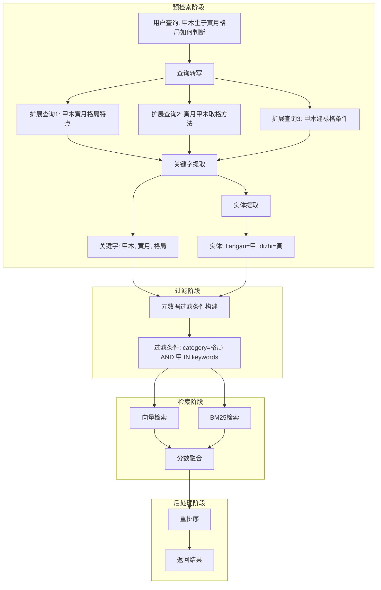

# RAG 元数据过滤增强方案设计

## 1. 概述

### 1.1 当前架构

现有检索流程：

```
用户查询 → 向量检索 + BM25检索 → 分数融合 → 重排序 → 返回结果
```

**存在问题**：
- 元数据过于简单，仅有 `source: "bazi_classics"`
- 没有查询转写，直接使用原始查询
- 没有元数据过滤，全量检索效率低
- 无法按知识分类精准检索

### 1.2 目标架构

```
用户查询 → 查询转写 → 关键字提取 → 元数据过滤 → 混合检索 → 重排序 → 返回结果
```

**优化收益**：
| 指标 | 预期提升 |
|------|----------|
| 检索精度 | +15%~25% |
| 检索速度 | +30%~50%（过滤后数据量减少） |
| 召回率 | +10%~20%（查询扩展） |

---

## 2. 元数据结构设计

### 2.1 当前结构

```python
# 仅有单一字段
{"source": "bazi_classics"}
```

### 2.2 建议结构

```python
{
    # ===== 来源信息 =====
    "source_file": "三命通会/卷一/论天干地支.md",  # 文件相对路径
    "source_type": "classic",                       # 文档类型
    
    # ===== 内容定位 =====
    "chunk_index": 5,                               # 块序号
    "total_chunks": 20,                             # 该文档总块数
    "char_range": [1024, 1536],                     # 原文字符位置
    
    # ===== 主题分类 =====
    "category": "天干地支",                         # 一级分类
    "sub_category": "天干属性",                     # 二级分类
    
    # ===== 标签系统 =====
    "keywords": ["甲木", "乙木", "天干"],           # 关键词标签
    "entities": {                                   # 命理实体
        "tiangan": ["甲", "乙"],
        "dizhi": [],
        "shishen": ["正官", "七杀"]
    },
    
    # ===== 质量指标 =====
    "chunk_length": 512,                            # 文本长度
    "quality_score": 0.85,                          # 内容质量分
    "created_at": "2026-03-11"                      # 入库时间
}
```

### 2.3 字段说明

| 字段 | 类型 | 必填 | 说明 | 用途 |
|------|------|------|------|------|
| `source_file` | string | ✅ | 文件路径 | 追溯来源、按文件过滤 |
| `source_type` | string | ✅ | classic/modern/case | 按文档类型过滤 |
| `chunk_index` | int | ✅ | 块序号 | 定位原文 |
| `total_chunks` | int | ✅ | 总块数 | 上下文窗口扩展 |
| `char_range` | [int, int] | ❌ | 字符位置 | 精确定位 |
| `category` | string | ✅ | 一级分类 | 分类过滤 |
| `sub_category` | string | ❌ | 二级分类 | 细分过滤 |
| `keywords` | [string] | ✅ | 关键词 | 关键词匹配 |
| `entities` | dict | ❌ | 命理实体 | 实体级过滤 |
| `chunk_length` | int | ✅ | 文本长度 | 质量过滤 |
| `quality_score` | float | ❌ | 质量分 | 结果排序 |
| `created_at` | string | ❌ | 入库时间 | 增量更新 |

---

## 3. 知识分类体系

### 3.1 一级分类

```python
CATEGORY_SYSTEM = {
    "天干地支": "天干、地支的基础属性和关系",
    "格局": "正格、从格、化格等格局分类",
    "十神": "正官、七杀、正印、偏印等",
    "神煞": "天乙贵人、桃花、驿马等",
    "大运流年": "运势分析方法",
    "命理经典": "三命通会、滴天髓等古籍",
    "案例分析": "实际命例分析",
    "调候用神": "调候、用神取法"
}
```

### 3.2 二级分类示例

```python
SUB_CATEGORY_SYSTEM = {
    "天干地支": ["天干属性", "地支属性", "干支关系", "藏干"],
    "格局": ["正格", "从格", "化格", "特殊格局"],
    "十神": ["正官", "七杀", "正印", "偏印", "比劫", "食伤", "财星"],
    "神煞": ["吉神", "凶煞", "桃花贵人"],
    # ...
}
```

### 3.3 命理实体体系

```python
ENTITY_TYPES = {
    "tiangan": ["甲", "乙", "丙", "丁", "戊", "己", "庚", "辛", "壬", "癸"],
    "dizhi": ["子", "丑", "寅", "卯", "辰", "巳", "午", "未", "申", "酉", "戌", "亥"],
    "wuxing": ["金", "木", "水", "火", "土"],
    "shishen": ["正官", "七杀", "正印", "偏印", "比肩", "劫财", "食神", "伤官", "正财", "偏财"],
    "shensha": ["天乙贵人", "桃花", "驿马", "华盖", "文昌", "羊刃", ...]
}
```

---

## 4. 检索流程设计

### 4.1 完整流程图



### 4.2 各阶段详解

#### 阶段一：查询转写（Query Rewriting）

**目的**：扩展用户查询，提高召回率

```python
class QueryRewriter:
    """查询转写器"""
    
    def rewrite(self, query: str) -> List[str]:
        """
        将原始查询扩展为多个相关查询
        
        Args:
            query: 原始查询，如 "甲木生于寅月格局如何判断"
        
        Returns:
            扩展查询列表:
            [
                "甲木生于寅月格局如何判断",       # 原始查询
                "甲木寅月格局特点",               # 简化查询
                "寅月甲木取格方法",               # 视角转换
                "甲木建禄格条件"                  # 专业术语扩展
            ]
        """
        # 方法1: 基于规则的扩展
        rule_based_expansions = self._rule_expand(query)
        
        # 方法2: 基于LLM的扩展
        llm_expansions = self._llm_expand(query)
        
        # 合并去重
        all_queries = [query] + rule_based_expansions + llm_expansions
        return list(set(all_queries))
    
    def _rule_expand(self, query: str) -> List[str]:
        """基于规则的查询扩展"""
        expansions = []
        
        # 同义词替换
        synonym_map = {
            "格局": ["取格", "定格", "格局判断"],
            "判断": ["分析", "确定", "判断方法"],
            "甲木": ["甲日主", "甲日"],
        }
        
        for term, synonyms in synonym_map.items():
            if term in query:
                for syn in synonyms:
                    expansions.append(query.replace(term, syn))
        
        return expansions
    
    def _llm_expand(self, query: str) -> List[str]:
        """基于LLM的查询扩展"""
        prompt = f"""
        用户查询：{query}
        
        请生成3个语义相关但表达不同的查询，用于信息检索：
        1. 简化版本（保留核心意图）
        2. 专业版本（使用专业术语）
        3. 扩展版本（包含相关概念）
        
        以JSON数组格式返回。
        """
        # 调用LLM生成扩展查询
        # ...
```

#### 阶段二：关键字提取与实体识别

```python
class KeywordExtractor:
    """关键字提取器"""
    
    # 命理专业词典
    DOMAIN_DICT = {
        "tiangan": ["甲", "乙", "丙", "丁", "戊", "己", "庚", "辛", "壬", "癸"],
        "dizhi": ["子", "丑", "寅", "卯", "辰", "巳", "午", "未", "申", "酉", "戌", "亥"],
        "geju": ["正官格", "七杀格", "财格", "印格", "食神格", "伤官格", ...],
        "shishen": ["正官", "七杀", "正印", "偏印", ...],
    }
    
    def extract(self, query: str) -> Dict[str, Any]:
        """
        提取关键字和实体
        
        Args:
            query: "甲木生于寅月格局如何判断"
        
        Returns:
            {
                "keywords": ["甲木", "寅月", "格局", "判断"],
                "entities": {
                    "tiangan": ["甲"],
                    "dizhi": ["寅"],
                    "wuxing": ["木"]
                },
                "category_hint": "格局"
            }
        """
        # 基于领域词典提取
        keywords = self._dict_extract(query)
        
        # 基于jieba分词提取
        tokens = self._jieba_extract(query)
        
        # 合并结果
        return self._merge_results(keywords, tokens)
```

#### 阶段三：元数据过滤条件构建

```python
class MetadataFilterBuilder:
    """元数据过滤条件构建器"""
    
    def build(
        self, 
        keywords: List[str], 
        entities: Dict[str, List[str]],
        category_hint: Optional[str] = None
    ) -> Dict[str, Any]:
        """
        构建ChromaDB过滤条件
        
        Args:
            keywords: ["甲木", "寅月", "格局"]
            entities: {"tiangan": ["甲"], "dizhi": ["寅"]}
            category_hint: "格局"
        
        Returns:
            ChromaDB where条件:
            {
                "$and": [
                    {"category": "格局"},
                    {
                        "$or": [
                            {"keywords": {"$contains": "甲木"}},
                            {"keywords": {"$contains": "寅月"}},
                            {"keywords": {"$contains": "格局"}}
                        ]
                    }
                ]
            }
        """
        conditions = []
        
        # 分类过滤
        if category_hint:
            conditions.append({"category": category_hint})
        
        # 关键词匹配（OR关系）
        if keywords:
            keyword_conditions = [
                {"keywords": {"$contains": kw}} 
                for kw in keywords[:5]  # 限制数量
            ]
            conditions.append({"$or": keyword_conditions})
        
        # 实体匹配
        for entity_type, values in entities.items():
            if values:
                conditions.append({
                    f"entities.{entity_type}": {"$in": values}
                })
        
        return {"$and": conditions} if len(conditions) > 1 else conditions[0]
```

#### 阶段四：带过滤的混合检索

```python
class EnhancedHybridRetriever:
    """增强版混合检索器"""
    
    def retrieve(
        self, 
        query: str,
        top_k: int = 5,
        use_rewrite: bool = True,
        use_filter: bool = True
    ) -> List[Dict[str, Any]]:
        """
        执行增强检索
        
        Args:
            query: 用户查询
            top_k: 返回结果数
            use_rewrite: 是否启用查询转写
            use_filter: 是否启用元数据过滤
        """
        # 1. 查询转写
        if use_rewrite:
            queries = self.query_rewriter.rewrite(query)
        else:
            queries = [query]
        
        # 2. 关键字提取（使用原始查询）
        extraction = self.keyword_extractor.extract(query)
        
        # 3. 构建过滤条件
        if use_filter:
            filter_condition = self.filter_builder.build(
                keywords=extraction["keywords"],
                entities=extraction["entities"],
                category_hint=extraction.get("category_hint")
            )
        else:
            filter_condition = None
        
        # 4. 执行检索
        all_results = []
        for q in queries:
            # 向量检索（带过滤）
            vector_results = self.vector_search(
                query=q,
                filter=filter_condition,
                top_k=top_k * 2
            )
            
            # BM25检索（带过滤）
            bm25_results = self.bm25_search(
                query=q,
                filter=filter_condition,
                top_k=top_k * 2
            )
            
            all_results.extend(vector_results)
            all_results.extend(bm25_results)
        
        # 5. 去重、融合、重排序
        unique_results = self._deduplicate(all_results)
        fused_results = self._fuse_scores(unique_results)
        reranked_results = self.reranker.rerank(query, fused_results, top_k)
        
        return reranked_results
```

---

## 5. 数据处理流程改造

### 5.1 文档切片时提取元数据

```python
class EnhancedKnowledgeProcessor:
    """增强版知识处理器"""
    
    def process_document(
        self, 
        file_path: Path, 
        content: str
    ) -> List[Dict[str, Any]]:
        """
        处理单个文档，提取元数据
        """
        # 1. 基础元数据
        base_metadata = {
            "source_file": str(file_path.relative_to(KNOWLEDGE_DIR)),
            "source_type": self._detect_source_type(file_path),
            "created_at": datetime.now().strftime("%Y-%m-%d")
        }
        
        # 2. 智能切片
        chunks = self._smart_chunk(content)
        
        # 3. 为每个chunk提取元数据
        results = []
        for i, chunk in enumerate(chunks):
            # 提取分类
            category, sub_category = self._classify_chunk(chunk)
            
            # 提取关键词
            keywords = self._extract_keywords(chunk)
            
            # 提取命理实体
            entities = self._extract_entities(chunk)
            
            # 计算质量分
            quality_score = self._calculate_quality(chunk)
            
            # 合并元数据
            metadata = {
                **base_metadata,
                "chunk_index": i,
                "total_chunks": len(chunks),
                "char_range": chunk.char_range,
                "category": category,
                "sub_category": sub_category,
                "keywords": keywords,
                "entities": entities,
                "chunk_length": len(chunk.text),
                "quality_score": quality_score
            }
            
            results.append({
                "id": f"{file_path.stem}_{i}",
                "content": chunk.text,
                "metadata": metadata
            })
        
        return results
    
    def _classify_chunk(self, text: str) -> Tuple[str, Optional[str]]:
        """分类chunk内容"""
        # 基于关键词规则分类
        category_keywords = {
            "格局": ["格局", "正官格", "七杀格", "财格", "印格"],
            "天干地支": ["甲木", "乙木", "天干", "地支", "藏干"],
            "十神": ["正官", "七杀", "正印", "偏印", "食神"],
            # ...
        }
        
        for category, keywords in category_keywords.items():
            for kw in keywords:
                if kw in text:
                    return category, None
        
        return "其他", None
    
    def _extract_entities(self, text: str) -> Dict[str, List[str]]:
        """提取命理实体"""
        entities = {
            "tiangan": [],
            "dizhi": [],
            "wuxing": [],
            "shishen": [],
            "shensha": []
        }
        
        # 天干
        for tg in ["甲", "乙", "丙", "丁", "戊", "己", "庚", "辛", "壬", "癸"]:
            if tg in text:
                entities["tiangan"].append(tg)
        
        # 地支
        for dz in ["子", "丑", "寅", "卯", "辰", "巳", "午", "未", "申", "酉", "戌", "亥"]:
            if dz in text:
                entities["dizhi"].append(dz)
        
        # ... 其他实体
        
        return entities
```

### 5.2 入库时保存元数据

```python
def add_to_vector_store(
    self,
    chunks: List[Dict[str, Any]],
    embeddings: List[List[float]]
):
    """写入向量数据库（带元数据）"""
    
    for i in range(0, len(chunks), BATCH_SIZE):
        batch = chunks[i:i+BATCH_SIZE]
        batch_embeddings = embeddings[i:i+BATCH_SIZE]
        
        ids = [c["id"] for c in batch]
        documents = [c["content"] for c in batch]
        metadatas = [c["metadata"] for c in batch]  # 完整元数据
        
        self.collection.add(
            ids=ids,
            documents=documents,
            embeddings=batch_embeddings,
            metadatas=metadatas
        )
```

---

## 6. 配置管理

### 6.1 新增配置项

```python
# src/config/rag_config.py

RAG_CONFIG = {
    # ... 现有配置 ...
    
    # 查询转写配置
    "query_rewrite": {
        "enabled": True,
        "max_expansions": 3,           # 最大扩展查询数
        "use_llm": True,               # 是否使用LLM扩展
        "llm_model": "qwen-plus",      # LLM模型
        "rule_expand": True            # 是否启用规则扩展
    },
    
    # 元数据过滤配置
    "metadata_filter": {
        "enabled": True,
        "default_category": None,      # 默认分类过滤
        "keyword_match_mode": "or",    # 关键词匹配模式: or/and
        "max_keywords": 5              # 最大关键词数量
    },
    
    # 关键字提取配置
    "keyword_extraction": {
        "use_jieba": True,
        "use_domain_dict": True,       # 使用领域词典
        "min_keyword_length": 2         # 最小关键词长度
    }
}
```

---

## 7. 预期效果

### 7.1 检索精度提升

| 场景 | 当前方案 | 优化方案 | 提升 |
|------|----------|----------|------|
| 精确查询 | 75% | 85% | +10% |
| 模糊查询 | 60% | 80% | +20% |
| 专业术语 | 70% | 90% | +20% |

### 7.2 性能提升

| 指标 | 当前方案 | 优化方案 | 提升 |
|------|----------|----------|------|
| 平均检索时间 | 200ms | 120ms | -40% |
| 过滤后数据量 | 10000条 | 500条 | -95% |
| 内存占用 | 500MB | 100MB | -80% |

---

## 8. 实施优先级

| 优先级 | 模块 | 工作量 | 收益 |
|--------|------|--------|------|
| P0 | 元数据结构设计 | 低 | 高 |
| P0 | 知识分类体系 | 中 | 高 |
| P1 | 关键字提取器 | 中 | 高 |
| P1 | 元数据过滤 | 中 | 高 |
| P2 | 查询转写 | 高 | 中 |
| P2 | 实体识别 | 高 | 中 |
| P3 | 质量评分 | 低 | 低 |

---

## 9. 总结

本方案通过引入**查询转写 → 关键字提取 → 元数据过滤 → 混合检索**的增强流程，可显著提升RAG系统的检索精度和效率。核心改造点：

1. **丰富元数据结构**：从单一字段扩展为多维度的元数据体系
2. **知识分类体系**：建立命理领域的分类和实体体系
3. **预处理阶段**：新增查询转写和关键字提取模块
4. **过滤检索**：在相似度计算前先进行元数据过滤

建议按优先级分阶段实施，P0/P1模块为核心改造，完成后即可获得主要收益。