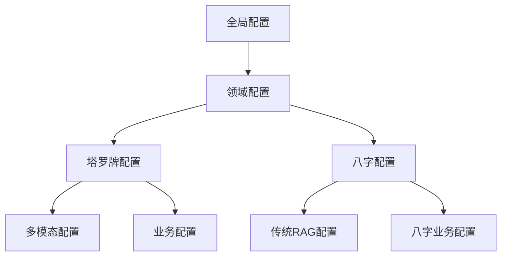

# 塔罗牌多模态RAG配置扩展方案

## 1. 配置需求分析

### 1.1 多领域配置需求
- **独立配置**: 塔罗牌和八字需要独立的配置参数
- **共享配置**: 通用RAG参数可以共享
- **动态切换**: 运行时根据Agent类型加载对应配置
- **向后兼容**: 现有配置不能破坏

### 1.2 配置维度
- **检索模式**: 多模态融合、纯文本、纯图像等
- **模型选择**: 文本编码器、图像编码器、融合策略
- **存储配置**: 向量库名称、持久化路径
- **性能参数**: 批次大小、缓存策略、超时设置
- **业务逻辑**: 牌组版本、默认参数、用户偏好

## 2. 配置架构设计

### 2.1 分层配置架构



### 2.2 配置文件结构

```
src/config/
├── rag_config.py              # 主配置入口
├── base_rag_config.py         # 基础RAG配置
├── tarot_config.py            # 塔罗牌专用配置
├── bazi_config.py             # 八字专用配置
└── multimodal_config.py       # 多模态通用配置
```

## 3. 具体配置实现

### 3.1 基础RAG配置 (base_rag_config.py)

```python
# src/config/base_rag_config.py
"""基础RAG配置 - 被所有领域共享"""

from typing import Dict, Any

BASE_RAG_CONFIG: Dict[str, Any] = {
    # 通用检索配置
    "retrieval_modes": {
        "vector_only": "仅向量检索",
        "bm25_only": "仅BM25检索", 
        "hybrid": "混合检索（无重排序）",
        "hybrid_rerank": "混合检索+重排序",
        "multimodal_fused": "多模态融合检索",
        "multimodal_separate": "多模态分离检索",
        "image_only": "纯图像检索",
        "text_only": "纯文本检索"
    },
    
    # 向量检索通用配置
    "vector": {
        "distance_metric": "cosine",
        "top_k": 10,
        "min_relevance_score": 0.3
    },
    
    # BM25通用配置  
    "bm25": {
        "k1": 1.5,
        "b": 0.75,
        "top_k": 10
    },
    
    # 混合检索通用配置
    "hybrid": {
        "candidate_multiplier": 4,
        "rerank_top_k": 5
    },
    
    # 重排序通用配置
    "rerank": {
        "model": "gte-rerank",
        "api_limit": {
            "calls_per_5_hours": 1200,
            "cooldown_seconds": 15
        }
    },
    
    # 后处理通用配置
    "post_processing": {
        "max_context_length": 2000,
        "deduplicate": True
    }
}
```

### 3.2 塔罗牌专用配置 (tarot_config.py)

```python
# src/config/tarot_config.py
"""塔罗牌专用配置"""

from typing import Dict, Any
from .base_rag_config import BASE_RAG_CONFIG

TAROT_RAG_CONFIG: Dict[str, Any] = {
    # 继承基础配置
    **BASE_RAG_CONFIG,
    
    # 多模态配置
    "multimodal": {
        "enabled": True,
        "text_encoder": {
            "model": "text-embedding-v4",
            "dimension": 768
        },
        "image_encoder": {
            "model": "OFA-Sys/chinese-clip-vit-base-patch16",
            "dimension": 768,
            "preprocess_size": [224, 224]
        },
        "fusion": {
            "strategy": "weighted_average",
            "text_weight": 0.3,
            "image_weight": 0.7,
            "output_dimension": 768
        }
    },
    
    # 塔罗特定配置
    "tarot": {
        "collection_name": "tarot_knowledge",
        "default_deck": "rider_waite_smith",
        "supported_decks": ["rider_waite_smith", "universal_waite"],
        "image_base_path": "/static/tarot/",
        "default_spread": "single_card",
        "supported_spreads": ["single_card", "three_card", "celtic_cross"]
    },
    
    # 塔罗检索模式覆盖
    "retrieval_mode": "multimodal_fused",
    
    # 向量检索覆盖
    "vector": {
        **BASE_RAG_CONFIG["vector"],
        "collection_name": "tarot_knowledge",
        "top_k": 5  # 塔罗牌数量少，减少top_k
    },
    
    # 禁用BM25（塔罗牌不适合关键词检索）
    "bm25": {
        **BASE_RAG_CONFIG["bm25"],
        "enabled": False
    },
    
    # 塔罗特定后处理
    "post_processing": {
        **BASE_RAG_CONFIG["post_processing"],
        "max_context_length": 1500,  # 塔罗牌描述较短
        "include_image_metadata": True
    }
}
```

### 3.3 八字配置保持兼容 (bazi_config.py)

```python
# src/config/bazi_config.py
"""八字专用配置 - 保持现有配置不变"""

from typing import Dict, Any
from .base_rag_config import BASE_RAG_CONFIG

BAZI_RAG_CONFIG: Dict[str, Any] = {
    # 继承基础配置
    **BASE_RAG_CONFIG,
    
    # 八字特定配置
    "bazi": {
        "collection_name": "bazi_knowledge",
        "default_analysis_mode": "full"
    },
    
    # 保持现有检索模式
    "retrieval_mode": "hybrid_rerank",
    
    # 向量检索覆盖
    "vector": {
        **BASE_RAG_CONFIG["vector"],
        "collection_name": "bazi_knowledge",
        "embedding_model": "text-embedding-v4"
    },
    
    # BM25配置
    "bm25": {
        **BASE_RAG_CONFIG["bm25"],
        "index_path": "data/bm25_index",
        "index_file": "bm25_index.json"
    }
}
```

### 3.4 多模态通用配置 (multimodal_config.py)

```python
# src/config/multimodal_config.py
"""多模态通用配置 - 可被其他多模态领域复用"""

from typing import Dict, Any

MULTIMODAL_DEFAULT_CONFIG: Dict[str, Any] = {
    "text_encoder_options": {
        "dashscope_text_embedding": {
            "model": "text-embedding-v4",
            "dimension": 768,
            "provider": "dashscope"
        },
        "openai_text_embedding": {
            "model": "text-embedding-3-small", 
            "dimension": 1536,
            "provider": "openai"
        }
    },
    
    "image_encoder_options": {
        "chinese_clip": {
            "model": "OFA-Sys/chinese-clip-vit-base-patch16",
            "dimension": 768,
            "preprocess_size": [224, 224],
            "provider": "huggingface"
        },
        "qwen_vl": {
            "model": "Qwen/Qwen-VL-Chat",
            "dimension": 1024,
            "preprocess_size": [448, 448],
            "provider": "huggingface"
        },
        "openai_clip": {
            "model": "openai/clip-vit-base-patch32",
            "dimension": 512,
            "preprocess_size": [224, 224],
            "provider": "huggingface"
        }
    },
    
    "fusion_strategies": {
        "weighted_average": {
            "description": "加权平均融合",
            "parameters": ["text_weight", "image_weight"]
        },
        "concatenation": {
            "description": "向量拼接融合", 
            "parameters": []
        },
        "cross_attention": {
            "description": "交叉注意力融合",
            "parameters": ["model_path", "num_heads"]
        }
    },
    
    "storage_options": {
        "chroma_db": {
            "description": "ChromaDB向量数据库",
            "supports_multimodal": True
        },
        "milvus": {
            "description": "Milvus向量数据库",
            "supports_multimodal": True
        },
        "pinecone": {
            "description": "Pinecone向量数据库", 
            "supports_multimodal": False
        }
    }
}
```

## 4. 配置管理器设计

### 4.1 统一配置管理器

```python
# src/config/rag_config_manager.py
"""统一RAG配置管理器"""

from typing import Dict, Any, Optional
import logging

from .base_rag_config import BASE_RAG_CONFIG
from .tarot_config import TAROT_RAG_CONFIG  
from .bazi_config import BAZI_RAG_CONFIG
from .multimodal_config import MULTIMODAL_DEFAULT_CONFIG

logger = logging.getLogger(__name__)

class RAGConfigManager:
    """RAG配置管理器 - 支持多领域配置"""
    
    # 领域配置映射
    DOMAIN_CONFIGS = {
        "tarot": TAROT_RAG_CONFIG,
        "bazi": BAZI_RAG_CONFIG,
        "default": BAZI_RAG_CONFIG  # 默认使用八字配置
    }
    
    @classmethod
    def get_config(cls, domain: str = "default") -> Dict[str, Any]:
        """获取指定领域的完整配置"""
        config = cls.DOMAIN_CONFIGS.get(domain, cls.DOMAIN_CONFIGS["default"])
        logger.debug(f"Loaded RAG config for domain: {domain}")
        return config
    
    @classmethod
    def get_retrieval_mode(cls, domain: str = "default") -> str:
        """获取当前检索模式"""
        config = cls.get_config(domain)
        return config.get("retrieval_mode", "hybrid_rerank")
    
    @classmethod
    def is_multimodal_enabled(cls, domain: str = "default") -> bool:
        """检查是否启用多模态"""
        config = cls.get_config(domain)
        return config.get("multimodal", {}).get("enabled", False)
    
    @classmethod
    def get_vector_config(cls, domain: str = "default") -> Dict[str, Any]:
        """获取向量检索配置"""
        config = cls.get_config(domain)
        return config.get("vector", {})
    
    @classmethod
    def get_multimodal_config(cls, domain: str = "default") -> Dict[str, Any]:
        """获取多模态配置"""
        config = cls.get_config(domain)
        return config.get("multimodal", {})
    
    @classmethod
    def get_tarot_specific_config(cls) -> Dict[str, Any]:
        """获取塔罗牌特定配置"""
        config = cls.get_config("tarot")
        return config.get("tarot", {})
    
    @classmethod
    def list_supported_domains(cls) -> list:
        """列出支持的领域"""
        return list(cls.DOMAIN_CONFIGS.keys())
    
    @classmethod
    def validate_config(cls, domain: str = "default") -> bool:
        """验证配置完整性"""
        try:
            config = cls.get_config(domain)
            
            # 基础验证
            required_keys = ["retrieval_mode", "vector"]
            for key in required_keys:
                if key not in config:
                    logger.error(f"Missing required config key: {key} for domain: {domain}")
                    return False
            
            # 多模态验证
            if cls.is_multimodal_enabled(domain):
                multimodal_config = config.get("multimodal", {})
                required_multimodal_keys = ["text_encoder", "image_encoder", "fusion"]
                for key in required_multimodal_keys:
                    if key not in multimodal_config:
                        logger.error(f"Missing required multimodal config key: {key}")
                        return False
            
            return True
            
        except Exception as e:
            logger.error(f"Config validation failed: {e}")
            return False
```

### 4.2 Agent配置集成

```python
# src/agents/tarot_agent.py (配置集成部分)
class TarotAgent(BaseAgent):
    
    def __init__(self):
        """初始化塔罗牌Agent - 集成配置管理"""
        self.config = RAGConfigManager.get_config("tarot")
        self.retriever = None
        self.prompt_registry = PromptRegistry()
        
        # 验证配置
        if not RAGConfigManager.validate_config("tarot"):
            raise ValueError("Invalid tarot RAG configuration")
    
    async def handle_analysis(
        self,
        session: UnifiedSession,
        slots: Dict[str, Any],
        mode: str = "full",
    ) -> Dict[str, Any]:
        """执行塔罗牌分析 - 使用配置驱动"""
        # ... 其他逻辑 ...
        
        # 从配置获取检索参数
        retrieval_mode = self.config.get("retrieval_mode", "multimodal_fused")
        top_k = self.config["vector"].get("top_k", 5)
        
        # 初始化检索器（使用配置）
        if self.retriever is None:
            collection_name = self.config["vector"]["collection_name"]
            self.retriever = MultiModalRetriever(
                collection_name=collection_name,
                retrieval_mode=retrieval_mode
            )
        
        # 执行检索
        results = await self.retriever.search(query, top_k=top_k)
        
        # ... 返回结果 ...
```

## 5. 环境变量支持

### 5.1 环境变量配置

```bash
# .env 文件
# 塔罗牌多模态配置
TAROT_MULTIMODAL_ENABLED=true
TAROT_TEXT_ENCODER_MODEL=text-embedding-v4
TAROT_IMAGE_ENCODER_MODEL=OFA-Sys/chinese-clip-vit-base-patch16
TAROT_FUSION_STRATEGY=weighted_average
TAROT_TEXT_WEIGHT=0.3
TAROT_IMAGE_WEIGHT=0.7

# 通用配置
RAG_RETRIEVAL_MODE=multimodal_fused
VECTOR_COLLECTION_NAME=tarot_knowledge
```

### 5.2 环境变量加载

```python
# src/config/env_loader.py
"""环境变量配置加载器"""

import os
from typing import Any, Optional

def load_env_config() -> dict:
    """从环境变量加载配置覆盖"""
    env_config = {}
    
    # 多模态开关
    multimodal_enabled = os.getenv("TAROT_MULTIMODAL_ENABLED", "true").lower() == "true"
    if not multimodal_enabled:
        env_config["multimodal"] = {"enabled": False}
    
    # 模型配置
    text_model = os.getenv("TAROT_TEXT_ENCODER_MODEL")
    if text_model:
        env_config.setdefault("multimodal", {}).setdefault("text_encoder", {})["model"] = text_model
    
    image_model = os.getenv("TAROT_IMAGE_ENCODER_MODEL")
    if image_model:
        env_config.setdefault("multimodal", {}).setdefault("image_encoder", {})["model"] = image_model
    
    # 融合策略
    fusion_strategy = os.getenv("TAROT_FUSION_STRATEGY")
    if fusion_strategy:
        env_config.setdefault("multimodal", {}).setdefault("fusion", {})["strategy"] = fusion_strategy
    
    text_weight = os.getenv("TAROT_TEXT_WEIGHT")
    if text_weight:
        env_config.setdefault("multimodal", {}).setdefault("fusion", {})["text_weight"] = float(text_weight)
    
    image_weight = os.getenv("TAROT_IMAGE_WEIGHT") 
    if image_weight:
        env_config.setdefault("multimodal", {}).setdefault("fusion", {})["image_weight"] = float(image_weight)
    
    # 检索模式
    retrieval_mode = os.getenv("RAG_RETRIEVAL_MODE")
    if retrieval_mode:
        env_config["retrieval_mode"] = retrieval_mode
    
    # 集合名称
    collection_name = os.getenv("VECTOR_COLLECTION_NAME")
    if collection_name:
        env_config.setdefault("vector", {})["collection_name"] = collection_name
    
    return env_config

def merge_config(base_config: dict, env_config: dict) -> dict:
    """合并基础配置和环境变量配置"""
    import copy
    merged = copy.deepcopy(base_config)
    
    def deep_merge(target: dict, source: dict):
        for key, value in source.items():
            if isinstance(value, dict) and key in target and isinstance(target[key], dict):
                deep_merge(target[key], value)
            else:
                target[key] = value
    
    deep_merge(merged, env_config)
    return merged
```

### 5.3 配置管理器集成环境变量

```python
# src/config/rag_config_manager.py (更新版)
class RAGConfigManager:
    
    @classmethod
    def get_config(cls, domain: str = "default") -> Dict[str, Any]:
        """获取指定领域的完整配置 - 支持环境变量覆盖"""
        base_config = cls.DOMAIN_CONFIGS.get(domain, cls.DOMAIN_CONFIGS["default"])
        
        # 加载环境变量配置
        env_config = load_env_config()
        
        # 合并配置
        final_config = merge_config(base_config, env_config)
        
        logger.debug(f"Loaded RAG config for domain: {domain}")
        return final_config
```

## 6. 配置热更新支持

### 6.1 配置文件监听

```python
# src/config/config_watcher.py
"""配置文件监听器 - 支持热更新"""

import os
import time
from watchdog.observers import Observer
from watchdog.events import FileSystemEventHandler
import logging

logger = logging.getLogger(__name__)

class ConfigReloadHandler(FileSystemEventHandler):
    """配置文件变更处理器"""
    
    def __init__(self, callback):
        self.callback = callback
        self.last_modified = {}
    
    def on_modified(self, event):
        if event.is_directory:
            return
        
        # 防止重复触发
        current_time = time.time()
        if self.last_modified.get(event.src_path, 0) + 1 > current_time:
            return
        self.last_modified[event.src_path] = current_time
        
        if event.src_path.endswith('.py'):
            logger.info(f"Config file changed: {event.src_path}")
            try:
                self.callback()
                logger.info("Config reloaded successfully")
            except Exception as e:
                logger.error(f"Config reload failed: {e}")

def start_config_watcher(config_dir: str, reload_callback):
    """启动配置文件监听"""
    observer = Observer()
    handler = ConfigReloadHandler(reload_callback)
    observer.schedule(handler, config_dir, recursive=True)
    observer.start()
    return observer
```

### 6.2 运行时配置更新

```python
# 在主应用中集成
def reload_rag_config():
    """重新加载RAG配置"""
    # 清除模块缓存
    import sys
    modules_to_reload = [
        'src.config.rag_config_manager',
        'src.config.tarot_config', 
        'src.config.bazi_config'
    ]
    
    for module in modules_to_reload:
        if module in sys.modules:
            del sys.modules[module]
    
    # 重新导入
    from src.config.rag_config_manager import RAGConfigManager
    # 配置已更新

# 启动监听
config_observer = start_config_watcher('src/config', reload_rag_config)
```

## 7. 配置验证和测试

### 7.1 配置验证测试

```python
# tests/test_config_validation.py
def test_tarot_config_validation():
    """测试塔罗牌配置验证"""
    from src.config.rag_config_manager import RAGConfigManager
    
    # 正常配置应该验证通过
    assert RAGConfigManager.validate_config("tarot") == True
    
    # 测试缺失关键配置
    original_config = RAGConfigManager.DOMAIN_CONFIGS["tarot"]
    try:
        # 临时移除关键配置
        RAGConfigManager.DOMAIN_CONFIGS["tarot"] = {"invalid": "config"}
        assert RAGConfigManager.validate_config("tarot") == False
    finally:
        RAGConfigManager.DOMAIN_CONFIGS["tarot"] = original_config

def test_multimodal_config_validation():
    """测试多模态配置验证"""
    from src.config.rag_config_manager import RAGConfigManager
    
    config = RAGConfigManager.get_config("tarot")
    multimodal_config = config.get("multimodal", {})
    
    # 验证多模态配置完整性
    assert "text_encoder" in multimodal_config
    assert "image_encoder" in multimodal_config  
    assert "fusion" in multimodal_config
```

### 7.2 配置覆盖测试

```python
# tests/test_config_override.py
def test_env_config_override():
    """测试环境变量配置覆盖"""
    import os
    from src.config.env_loader import load_env_config, merge_config
    from src.config.tarot_config import TAROT_RAG_CONFIG
    
    # 设置环境变量
    os.environ["TAROT_TEXT_WEIGHT"] = "0.5"
    os.environ["RAG_RETRIEVAL_MODE"] = "text_only"
    
    try:
        env_config = load_env_config()
        merged_config = merge_config(TAROT_RAG_CONFIG, env_config)
        
        # 验证覆盖生效
        assert merged_config["multimodal"]["fusion"]["text_weight"] == 0.5
        assert merged_config["retrieval_mode"] == "text_only"
        
    finally:
        # 清理环境变量
        os.environ.pop("TAROT_TEXT_WEIGHT", None)
        os.environ.pop("RAG_RETRIEVAL_MODE", None)
```

## 8. 部署和运维考虑

### 8.1 配置版本管理

```yaml
# config/version.yaml
version: "1.0.0"
domains:
  - tarot
  - bazi
features:
  - multimodal_rag
  - hybrid_retrieval
compatibility:
  min_python_version: "3.8"
  required_dependencies:
    - chromadb>=0.4.0
    - torch>=1.12.0
    - transformers>=4.20.0
```

### 8.2 配置备份和恢复

```python
# scripts/backup_config.py
def backup_current_config(backup_dir: str):
    """备份当前配置"""
    import shutil
    import datetime
    
    timestamp = datetime.datetime.now().strftime("%Y%m%d_%H%M%S")
    backup_path = os.path.join(backup_dir, f"config_backup_{timestamp}")
    
    shutil.copytree("src/config", backup_path)
    print(f"Configuration backed up to: {backup_path}")

def restore_config(backup_path: str):
    """从备份恢复配置"""
    import shutil
    
    shutil.rmtree("src/config")
    shutil.copytree(backup_path, "src/config")
    print(f"Configuration restored from: {backup_path}")
```

## 9. 总结

### 9.1 配置扩展优势

| 优势 | 说明 |
|------|------|
| **模块化** | 各领域配置独立，互不影响 |
| **可扩展** | 新增领域只需添加配置文件 |
| **灵活性** | 环境变量支持运行时调整 |
| **安全性** | 配置验证防止错误配置 |
| **可维护** | 清晰的配置结构和文档 |

### 9.2 实施建议

1. **渐进式迁移**: 先实现基础配置分离，再添加多模态配置
2. **充分测试**: 配置变更必须经过完整测试
3. **文档完善**: 为每个配置项提供详细说明
4. **监控告警**: 配置加载失败时及时告警
5. **版本控制**: 配置变更纳入版本管理

这套配置扩展方案既满足了塔罗牌多模态RAG的需求，又保持了与现有八字系统的兼容性，为未来更多领域的扩展奠定了坚实基础。