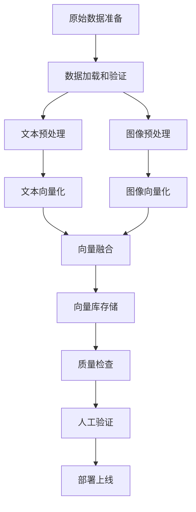

# 塔罗牌知识库构建流程

## 1. 数据准备阶段

### 1.1 原始数据目录结构

```
knowledge_base/
├── raw/
│   └── tarot/
│       ├── rider_waite_smith/           # Rider-Waite-Smith 版本
│       │   ├── major_arcana/            # 大阿卡纳 (22张)
│       │   │   ├── 00_fool.json
│       │   │   ├── 01_magician.json
│       │   │   ├── 02_high_priestess.json
│       │   │   └── ... (22个文件)
│       │   ├── minor_arcana/            # 小阿卡纳 (56张)
│       │   │   ├── cups/                # 圣杯组
│       │   │   │   ├── 01_ace_of_cups.json
│       │   │   │   ├── 02_two_of_cups.json
│       │   │   │   └── ... (14个文件)
│       │   │   ├── wands/               # 权杖组
│       │   │   ├── swords/              # 宝剑组  
│       │   │   └── pentacles/           # 星币组
│       │   └── images/                  # 图片资源
│       │       ├── major/
│       │       │   ├── 00_fool.jpg
│       │       │   └── ...
│       │       └── minor/
│       │           ├── cups/
│       │           ├── wands/
│       │           ├── swords/
│       │           └── pentacles/
│       └── universal_waite/             # Universal Waite 版本
│           └── ... (same structure as above)
└── processed/
    └── tarot_chunks.json               # 处理后的数据
```

### 1.2 单张塔罗牌JSON数据格式

```json
{
  "id": "major_00_fool_rws",
  "card_name": "愚者",
  "arcana": "major",
  "number": 0,
  "deck_version": "rider_waite_smith",
  "image_path": "knowledge_base/raw/tarot/rider_waite_smith/images/major/00_fool.jpg",
  "description": "愚者代表新的开始、冒险精神和无限可能。这张牌描绘了一个年轻人站在悬崖边，背着行囊，仰望天空，一只小狗在他脚边...",
  "keywords": ["新开始", "冒险", "纯真", "自由", "无限可能"],
  "upright_meaning": [
    "新的机会和开始",
    "冒险精神和勇气", 
    "自发性和创造力",
    "天真和纯真",
    "无限的潜力"
  ],
  "reversed_meaning": [
    "鲁莽和冲动",
    "缺乏计划和方向",
    "愚蠢的决定",
    "逃避责任",
    "过度天真"
  ],
  "symbolism": {
    "figure": "年轻人站在悬崖边，象征着站在人生十字路口",
    "backpack": "背上的行囊包含过去的经验和教训",
    "white_sun": "头顶的白色太阳代表纯洁的启示和神圣指引",
    "dog": "忠诚的狗代表本能和直觉",
    "cliff": "悬崖代表未知的风险和机遇"
  },
  "traditional_interpretation": "在传统塔罗解读中，愚者是大阿卡纳的第一张牌，代表旅程的开始...",
  "modern_interpretation": "现代解读中，愚者更多强调创新思维和打破常规..."
}
```

### 1.3 数据来源策略

#### 1.3.1 文本数据来源
- **权威塔罗书籍**: 《78度的智慧》、《塔罗解密》等
- **专业塔罗网站**: Biddy Tarot、Tarot.com 等（需注意版权）
- **开源塔罗项目**: GitHub 上的开源塔罗数据集
- **自行编写**: 基于多个来源综合编写，避免版权问题

#### 1.3.2 图片数据来源
- **公共领域**: 使用已进入公共领域的塔罗牌图片
- **开源授权**: 使用CC0或MIT授权的塔罗牌图片
- **自行绘制**: 简化版塔罗牌面（推荐，避免版权问题）
- **购买授权**: 购买商业使用授权（成本较高）

**推荐策略**: 自行绘制简化版Rider-Waite风格塔罗牌，既避免版权问题，又能保证风格统一。

## 2. 数据处理阶段

### 2.1 数据加载和验证

```python
# src/rag/builders/tarot_data_loader.py
def load_tarot_raw_data(base_path: str) -> List[Dict[str, Any]]:
    """加载原始塔罗牌数据"""
    cards = []
    
    # 遍历所有牌组版本
    for deck_version in os.listdir(base_path):
        deck_path = os.path.join(base_path, deck_version)
        if not os.path.isdir(deck_path):
            continue
            
        # 加载大阿卡纳
        major_path = os.path.join(deck_path, "major_arcana")
        if os.path.exists(major_path):
            major_cards = load_cards_from_directory(major_path, "major", deck_version)
            cards.extend(major_cards)
        
        # 加载小阿卡纳
        minor_path = os.path.join(deck_path, "minor_arcana") 
        if os.path.exists(minor_path):
            for suit in ["cups", "wands", "swords", "pentacles"]:
                suit_path = os.path.join(minor_path, suit)
                if os.path.exists(suit_path):
                    suit_cards = load_cards_from_directory(suit_path, "minor", deck_version, suit)
                    cards.extend(suit_cards)
    
    # 验证数据完整性
    validate_tarot_data(cards)
    return cards

def validate_tarot_data(cards: List[Dict[str, Any]]):
    """验证塔罗牌数据完整性"""
    required_fields = ["id", "card_name", "arcana", "number", "description", "image_path"]
    for card in cards:
        for field in required_fields:
            if field not in card or not card[field]:
                raise ValueError(f"Card {card.get('id', 'unknown')} missing required field: {field}")
        
        # 验证图片文件存在
        if not os.path.exists(card["image_path"]):
            raise FileNotFoundError(f"Image not found: {card['image_path']}")
```

### 2.2 文本预处理

```python
# src/rag/builders/text_preprocessor.py
def preprocess_tarot_text(text: str) -> str:
    """预处理塔罗牌文本"""
    # 1. 清理特殊字符
    text = re.sub(r'[^\u4e00-\u9fa5a-zA-Z0-9\s\.\,\!\?\:\;\-\(\)\[\]]', ' ', text)
    
    # 2. 标准化空白字符
    text = re.sub(r'\s+', ' ', text).strip()
    
    # 3. 分段处理（保持语义完整性）
    paragraphs = text.split('\n')
    cleaned_paragraphs = []
    for para in paragraphs:
        if len(para.strip()) > 10:  # 过滤过短段落
            cleaned_paragraphs.append(para.strip())
    
    return '\n'.join(cleaned_paragraphs)

def enhance_tarot_description(card_data: Dict[str, Any]) -> str:
    """增强塔罗牌描述文本"""
    base_desc = card_data["description"]
    
    # 添加关键词
    keywords = "，".join(card_data.get("keywords", []))
    enhanced_desc = f"{base_desc}\n\n关键词：{keywords}"
    
    # 添加正位含义
    if card_data.get("upright_meaning"):
        upright = "；".join(card_data["upright_meaning"])
        enhanced_desc += f"\n\n正位含义：{upright}"
    
    # 添加逆位含义  
    if card_data.get("reversed_meaning"):
        reversed_meaning = "；".join(card_data["reversed_meaning"])
        enhanced_desc += f"\n\n逆位含义：{reversed_meaning}"
    
    return enhanced_desc
```

### 2.3 图像预处理

```python
# src/rag/builders/image_preprocessor.py
def preprocess_tarot_image(image_path: str, output_size: Tuple[int, int] = (224, 224)) -> str:
    """预处理塔罗牌图片"""
    try:
        # 1. 加载图片
        image = Image.open(image_path)
        
        # 2. 转换为RGB（处理RGBA等格式）
        if image.mode != 'RGB':
            image = image.convert('RGB')
        
        # 3. 调整大小
        image = image.resize(output_size, Image.Resampling.LANCZOS)
        
        # 4. 保存预处理后的图片
        output_path = image_path.replace('.jpg', '_processed.jpg')
        image.save(output_path, 'JPEG', quality=95, optimize=True)
        
        return output_path
        
    except Exception as e:
        logger.error(f"Image preprocessing failed for {image_path}: {e}")
        raise

def batch_preprocess_images(image_paths: List[str], output_dir: str):
    """批量预处理图片"""
    processed_paths = []
    for image_path in image_paths:
        try:
            processed_path = preprocess_tarot_image(image_path)
            processed_paths.append(processed_path)
        except Exception as e:
            logger.warning(f"Skipping image {image_path}: {e}")
            continue
    return processed_paths
```

## 3. 向量化阶段

### 3.1 多模态向量化流程

```python
# src/rag/builders/vectorizer.py
class TarotVectorizer:
    """塔罗牌多模态向量化器"""
    
    def __init__(
        self,
        text_encoder: TextEncoder,
        image_encoder: ImageEncoder, 
        fusion_strategy: FusionStrategy
    ):
        self.text_encoder = text_encoder
        self.image_encoder = image_encoder
        self.fusion_strategy = fusion_strategy
    
    def vectorize_card(self, card_data: Dict[str, Any]) -> Dict[str, Any]:
        """向量化单张塔罗牌"""
        # 1. 文本向量化
        enhanced_text = enhance_tarot_description(card_data)
        text_emb = self.text_encoder.encode(enhanced_text)
        
        # 2. 图像向量化
        processed_image_path = preprocess_tarot_image(card_data["image_path"])
        image_emb = self.image_encoder.encode(processed_image_path)
        
        # 3. 融合向量化
        fused_emb = self.fusion_strategy.fuse(text_emb, image_emb)
        
        return {
            "id": card_data["id"],
            "document": enhanced_text,
            "metadata": {
                **card_data,
                "processed_image_path": processed_image_path,
                "fusion_config": self.fusion_strategy.get_config()
            },
            "embeddings": {
                "text": text_emb.tolist(),
                "image": image_emb.tolist(), 
                "fused": fused_emb.tolist()
            }
        }
    
    def vectorize_cards_batch(self, cards_data: List[Dict[str, Any]]) -> List[Dict[str, Any]]:
        """批量向量化塔罗牌"""
        vectorized_cards = []
        
        # 并行处理文本和图像
        with ThreadPoolExecutor(max_workers=4) as executor:
            futures = [
                executor.submit(self.vectorize_card, card_data)
                for card_data in cards_data
            ]
            
            for future in tqdm(futures, desc="Vectorizing cards"):
                try:
                    result = future.result()
                    vectorized_cards.append(result)
                except Exception as e:
                    logger.error(f"Vectorization failed: {e}")
                    continue
        
        return vectorized_cards
```

### 3.2 批量处理优化

```python
def build_tarot_knowledge_base_optimized():
    """优化的塔罗牌知识库构建流程"""
    
    # 1. 加载配置
    config = load_multimodal_config()
    
    # 2. 初始化组件
    text_encoder = TextEncoder(config["text_encoder"]["model"])
    image_encoder = ImageEncoder(config["image_encoder"]["model"]) 
    fusion_strategy = create_fusion_strategy(config["fusion"])
    vectorizer = TarotVectorizer(text_encoder, image_encoder, fusion_strategy)
    
    # 3. 加载原始数据
    raw_cards = load_tarot_raw_data("knowledge_base/raw/tarot")
    logger.info(f"Loaded {len(raw_cards)} tarot cards")
    
    # 4. 分批向量化（避免内存溢出）
    batch_size = 10
    all_vectorized = []
    
    for i in range(0, len(raw_cards), batch_size):
        batch = raw_cards[i:i+batch_size]
        logger.info(f"Processing batch {i//batch_size + 1}/{(len(raw_cards)-1)//batch_size + 1}")
        
        vectorized_batch = vectorizer.vectorize_cards_batch(batch)
        all_vectorized.extend(vectorized_batch)
        
        # 释放内存
        del vectorized_batch
        gc.collect()
    
    # 5. 保存处理结果
    save_processed_tarot_data(all_vectorized, "knowledge_base/processed/tarot_chunks.json")
    
    # 6. 构建向量库
    vector_store = MultiModalVectorStore(
        collection_name=config["storage"]["collection_name"],
        persist_directory=config["storage"]["persist_directory"]
    )
    vector_store.add_tarot_cards_batch(all_vectorized)
    
    logger.info(f"Successfully built tarot knowledge base with {len(all_vectorized)} cards")
```

## 4. 质量控制阶段

### 4.1 数据质量检查

```python
# src/rag/builders/quality_checker.py
def check_tarot_data_quality(vectorized_cards: List[Dict[str, Any]]):
    """检查塔罗牌数据质量"""
    
    issues = []
    
    for card in vectorized_cards:
        # 1. 检查向量维度
        if len(card["embeddings"]["text"]) != 768:
            issues.append(f"Text embedding dimension mismatch for {card['id']}")
        
        if len(card["embeddings"]["image"]) != 768:
            issues.append(f"Image embedding dimension mismatch for {card['id']}")
        
        # 2. 检查向量值范围
        text_norm = np.linalg.norm(card["embeddings"]["text"])
        if abs(text_norm - 1.0) > 0.01:  # 应该是单位向量
            issues.append(f"Text embedding not normalized for {card['id']}")
        
        image_norm = np.linalg.norm(card["embeddings"]["image"])
        if abs(image_norm - 1.0) > 0.01:
            issues.append(f"Image embedding not normalized for {card['id']}")
        
        # 3. 检查元数据完整性
        required_metadata = ["card_name", "arcana", "number", "image_path"]
        for field in required_metadata:
            if field not in card["metadata"]:
                issues.append(f"Missing metadata field {field} for {card['id']}")
    
    if issues:
        logger.warning(f"Found {len(issues)} quality issues:")
        for issue in issues[:10]:  # 只显示前10个
            logger.warning(f"  - {issue}")
    
    return len(issues) == 0
```

### 4.2 人工抽样验证

- **随机抽样**: 从78张牌中随机抽取10-20张进行人工验证
- **验证内容**: 
  - 文本描述准确性
  - 图片与文本匹配度
  - 向量检索相关性
  - 正逆位含义完整性
- **验收标准**: 抽样准确率 ≥ 95%

## 5. 自动化构建脚本

### 5.1 主构建脚本

```python
# src/rag/build_tarot_knowledge.py
#!/usr/bin/env python3
"""
塔罗牌多模态知识库构建主脚本
"""

import argparse
import logging
from pathlib import Path

from src.rag.builders.tarot_builder import build_tarot_knowledge_base_optimized
from src.config.multimodal_config import MULTIMODAL_CONFIG

def main():
    parser = argparse.ArgumentParser(description="Build Tarot Multimodal Knowledge Base")
    parser.add_argument("--config", type=str, default="tarot", help="Configuration name")
    parser.add_argument("--force", action="store_true", help="Force rebuild even if up to date")
    parser.add_argument("--verbose", action="store_true", help="Enable verbose logging")
    
    args = parser.parse_args()
    
    # 设置日志
    log_level = logging.DEBUG if args.verbose else logging.INFO
    logging.basicConfig(level=log_level, format='%(asctime)s - %(levelname)s - %(message)s')
    
    # 构建知识库
    try:
        build_tarot_knowledge_base_optimized()
        print("✅ 塔罗牌多模态知识库构建完成！")
    except Exception as e:
        print(f"❌ 塔罗牌知识库构建失败: {e}")
        exit(1)

if __name__ == "__main__":
    main()
```

### 5.2 增量更新支持

```python
def check_if_rebuild_needed() -> bool:
    """检查是否需要重新构建知识库"""
    # 1. 检查原始数据是否有更新
    raw_md5 = compute_directory_md5("knowledge_base/raw/tarot")
    
    # 2. 检查处理记录
    processed_record = load_processed_md5()
    last_build_md5 = processed_record.get("tarot_raw_md5", "")
    
    # 3. 比较MD5
    return raw_md5 != last_build_md5

def incremental_update():
    """增量更新知识库"""
    if not check_if_rebuild_needed():
        logger.info("No changes detected, skipping rebuild")
        return
    
    # 执行完整构建
    build_tarot_knowledge_base_optimized()
```

## 6. 构建流程总结

### 6.1 完整流程图



### 6.2 时间估算

| 阶段 | 时间估算 | 说明 |
|------|----------|------|
| 数据准备 | 2-3天 | 收集和整理78张牌的数据 |
| 数据处理 | 1天 | 脚本开发和测试 |
| 向量化 | 2-4小时 | 78张牌的向量化处理 |
| 质量检查 | 1天 | 人工验证和修正 |
| **总计** | **4-6天** | 不包括数据收集时间 |

### 6.3 资源需求

- **存储空间**: ~500MB（原始数据 + 向量库）
- **计算资源**: GPU加速可显著提升图像编码速度
- **人力投入**: 1人全职工作4-6天
- **依赖工具**: Python, PyTorch, Chinese-CLIP, ChromaDB

## 7. 风险管理

### 7.1 主要风险

| 风险 | 影响 | 缓解措施 |
|------|------|----------|
| 版权问题 | 法律风险 | 使用自绘图片或公共领域资源 |
| 数据质量 | 准确性下降 | 严格的质量检查和人工验证 |
| 性能问题 | 响应慢 | 异步处理、缓存优化、GPU加速 |
| 兼容性问题 | 系统不稳定 | 充分测试、降级方案 |

### 7.2 备用方案

- **纯文本方案**: 如果多模态效果不理想，可回退到纯文本RAG
- **简化图片**: 使用图标替代完整塔罗牌面
- **外部API**: 使用第三方塔罗牌API作为备用数据源