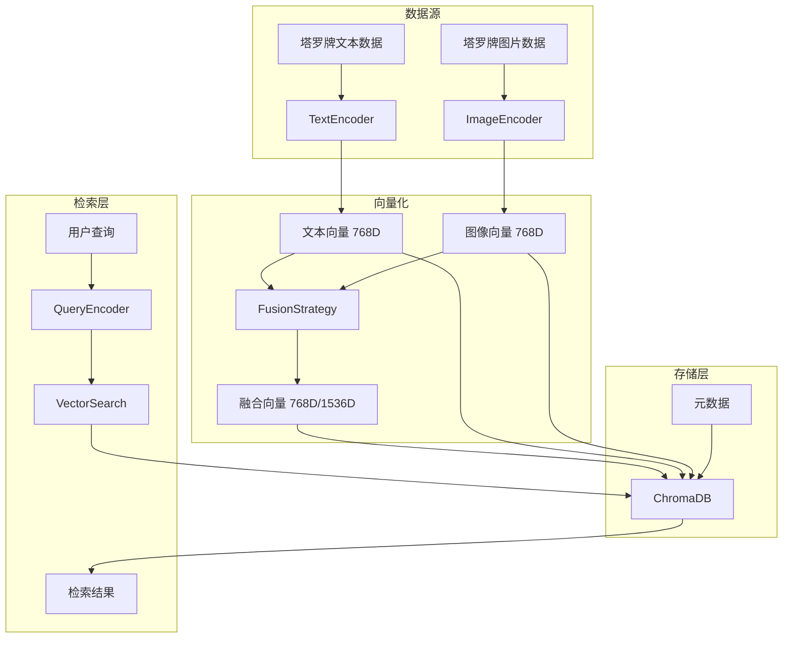

# 多模态向量存储方案设计

## 1. 存储需求分析

### 1.1 数据类型
- **文本数据**: 塔罗牌义描述、关键词、正逆位含义、象征意义
- **图像数据**: 塔罗牌面图片（78张 × 多版本）
- **元数据**: 牌名、牌组版本、分类信息、图片路径等

### 1.2 向量类型
- **文本向量**: 768维（DashScope text-embedding-v4）
- **图像向量**: 768维（Chinese-CLIP ViT-B/16）
- **融合向量**: 768维（加权平均）或 1536维（拼接）

### 1.3 检索需求
- **纯文本检索**: 用户文字查询
- **纯图像检索**: 用户上传图片查询（可选）
- **多模态融合检索**: 文字查询 + 图像上下文
- **跨模态检索**: 文字查询检索图像，图像查询检索文字

## 2. 存储架构设计

### 2.1 整体架构



### 2.2 ChromaDB Collection 设计

#### 方案A: 单Collection多向量字段（推荐）

```json
{
  "id": "major_00_fool_rws",
  "document": "愚者牌义文本描述...",
  "metadata": {
    "card_name": "愚者",
    "arcana": "major",
    "number": 0,
    "deck_version": "rider_waite_smith",
    "image_path": "/static/tarot/rider_waite/major/00_fool.jpg",
    "keywords": ["新开始", "冒险", "纯真", "自由"],
    "upright_meaning": ["新机会", "冒险精神", "自发"],
    "reversed_meaning": ["鲁莽", "冒险", "缺乏计划"]
  },
  "embedding": [0.28, 0.29, ...],  // 融合向量（主检索）
  "embeddings": {                   // 扩展字段（备用）
    "text": [0.12, 0.34, ...],
    "image": [0.45, 0.23, ...],
    "fused": [0.28, 0.29, ...]
  }
}
```

#### 方案B: 多Collection分离存储

```
collections/
├── tarot_text_collection/      # 纯文本向量
├── tarot_image_collection/     # 纯图像向量  
├── tarot_fused_collection/     # 融合向量（主用）
└── tarot_metadata/            # 元数据（可选）
```

**推荐方案A**：单Collection更简单，维护成本低，查询效率高。

## 3. 向量编码器设计

### 3.1 TextEncoder

```python
# src/rag/encoders/text_encoder.py
class TextEncoder:
    """文本编码器 - 使用DashScope TextEmbedding"""
    
    def __init__(self, model: str = "text-embedding-v4"):
        self.model = model
        self.api_key = os.getenv("DASHSCOPE_API_KEY")
        if not self.api_key:
            raise ValueError("DASHSCOPE_API_KEY not set")
        dashscope.api_key = self.api_key
    
    def encode(self, text: str) -> np.ndarray:
        """编码单个文本"""
        try:
            response = TextEmbedding.call(
                model=self.model,
                input=[text]
            )
            if response.status_code == 200:
                return np.array(response.output['embeddings'][0]['embedding'])
            else:
                raise RuntimeError(f"Text embedding failed: {response.code}")
        except Exception as e:
            logger.error(f"Text encoding error: {e}")
            raise
    
    def batch_encode(self, texts: List[str]) -> np.ndarray:
        """批量编码文本"""
        # DashScope API 支持批量，但有长度限制
        embeddings = []
        for i in range(0, len(texts), 10):  # 批次大小10
            batch = texts[i:i+10]
            response = TextEmbedding.call(
                model=self.model,
                input=batch
            )
            if response.status_code == 200:
                batch_embs = [emb['embedding'] for emb in response.output['embeddings']]
                embeddings.extend(batch_embs)
            else:
                raise RuntimeError(f"Batch text embedding failed: {response.code}")
        
        return np.array(embeddings)
```

### 3.2 ImageEncoder

```python
# src/rag/encoders/image_encoder.py
class ImageEncoder:
    """图像编码器 - 使用Chinese-CLIP"""
    
    def __init__(self, model_name: str = "OFA-Sys/chinese-clip-vit-base-patch16"):
        self.device = "cuda" if torch.cuda.is_available() else "cpu"
        self.model, self.preprocess = clip.load(model_name, device=self.device)
        self.model.eval()
    
    def encode(self, image_path: str) -> np.ndarray:
        """编码单个图像"""
        try:
            image = Image.open(image_path).convert("RGB")
            image_input = self.preprocess(image).unsqueeze(0).to(self.device)
            
            with torch.no_grad():
                image_features = self.model.encode_image(image_input)
                image_features /= image_features.norm(dim=-1, keepdim=True)
            
            return image_features.cpu().numpy().flatten()
            
        except Exception as e:
            logger.error(f"Image encoding error for {image_path}: {e}")
            raise
    
    def encode_pil(self, pil_image: Image.Image) -> np.ndarray:
        """编码PIL图像对象"""
        try:
            image_input = self.preprocess(pil_image).unsqueeze(0).to(self.device)
            
            with torch.no_grad():
                image_features = self.model.encode_image(image_input)
                image_features /= image_features.norm(dim=-1, keepdim=True)
            
            return image_features.cpu().numpy().flatten()
            
        except Exception as e:
            logger.error(f"PIL image encoding error: {e}")
            raise
```

## 4. 向量融合策略

### 4.1 融合策略接口

```python
# src/rag/fusion/strategy.py
from abc import ABC, abstractmethod
from typing import Dict, Any
import numpy as np

class FusionStrategy(ABC):
    """向量融合策略抽象基类"""
    
    @abstractmethod
    def fuse(
        self, 
        text_emb: np.ndarray, 
        image_emb: np.ndarray,
        **kwargs
    ) -> np.ndarray:
        """融合文本和图像向量"""
        pass
    
    @abstractmethod
    def get_config(self) -> Dict[str, Any]:
        """获取策略配置"""
        pass
```

### 4.2 具体融合策略实现

#### 4.2.1 加权平均融合

```python
class WeightedAverageFusion(FusionStrategy):
    """加权平均融合策略"""
    
    def __init__(self, text_weight: float = 0.3, image_weight: float = 0.7):
        self.text_weight = text_weight
        self.image_weight = image_weight
    
    def fuse(
        self, 
        text_emb: np.ndarray, 
        image_emb: np.ndarray,
        **kwargs
    ) -> np.ndarray:
        """加权平均融合"""
        if text_emb.shape != image_emb.shape:
            raise ValueError("Text and image embeddings must have same shape")
        
        return (
            self.text_weight * text_emb + 
            self.image_weight * image_emb
        )
    
    def get_config(self) -> Dict[str, Any]:
        return {
            "strategy": "weighted_average",
            "text_weight": self.text_weight,
            "image_weight": self.image_weight
        }
```

#### 4.2.2 拼接融合

```python
class ConcatenationFusion(FusionStrategy):
    """拼接融合策略"""
    
    def __init__(self):
        pass
    
    def fuse(
        self, 
        text_emb: np.ndarray, 
        image_emb: np.ndarray,
        **kwargs
    ) -> np.ndarray:
        """拼接融合"""
        return np.concatenate([text_emb, image_emb])
    
    def get_config(self) -> Dict[str, Any]:
        return {
            "strategy": "concatenation",
            "output_dim": text_emb.shape[0] + image_emb.shape[0]
        }
```

#### 4.2.3 交叉注意力融合（高级）

```python
class CrossAttentionFusion(FusionStrategy):
    """交叉注意力融合策略（需要额外训练）"""
    
    def __init__(self, model_path: Optional[str] = None):
        # 加载预训练的交叉注意力模型
        self.model = self._load_model(model_path)
    
    def _load_model(self, model_path: Optional[str]):
        # 实现模型加载逻辑
        pass
    
    def fuse(
        self, 
        text_emb: np.ndarray, 
        image_emb: np.ndarray,
        **kwargs
    ) -> np.ndarray:
        """交叉注意力融合"""
        # 实现交叉注意力计算
        pass
    
    def get_config(self) -> Dict[str, Any]:
        return {
            "strategy": "cross_attention",
            "model_path": self.model_path
        }
```

## 5. VectorStore 扩展设计

### 5.1 多模态VectorStore类

```python
# src/rag/vector_store/multimodal_vector_store.py
class MultiModalVectorStore:
    """多模态向量存储管理器"""
    
    def __init__(
        self,
        persist_directory: str = "chroma_db",
        collection_name: str = "tarot_knowledge",
        text_encoder: Optional[TextEncoder] = None,
        image_encoder: Optional[ImageEncoder] = None,
        fusion_strategy: Optional[FusionStrategy] = None,
        hnsw_config: Optional[Dict[str, Any]] = None
    ):
        self.persist_directory = persist_directory
        self.collection_name = collection_name
        self.text_encoder = text_encoder or TextEncoder()
        self.image_encoder = image_encoder or ImageEncoder()
        self.fusion_strategy = fusion_strategy or WeightedAverageFusion()
        self.hnsw_config = hnsw_config or self.HNSW_DEFAULT_CONFIG
        
        # 初始化ChromaDB
        Path(persist_directory).mkdir(parents=True, exist_ok=True)
        self.client = chromadb.PersistentClient(
            path=persist_directory,
            settings=Settings(anonymized_telemetry=False, allow_reset=True)
        )
        
        self.collection = self.client.get_or_create_collection(
            name=collection_name,
            metadata=self.hnsw_config
        )
    
    def add_tarot_card(
        self,
        card_id: str,
        text_content: str,
        image_path: str,
        metadata: Dict[str, Any]
    ):
        """添加单张塔罗牌到向量库"""
        # 1. 文本向量化
        text_emb = self.text_encoder.encode(text_content)
        
        # 2. 图像向量化
        image_emb = self.image_encoder.encode(image_path)
        
        # 3. 融合向量化
        fused_emb = self.fusion_strategy.fuse(text_emb, image_emb)
        
        # 4. 存储到ChromaDB
        self.collection.add(
            ids=[card_id],
            embeddings=[fused_emb.tolist()],
            metadatas=[{
                **metadata,
                "image_path": image_path,
                "has_image": True,
                "fusion_config": self.fusion_strategy.get_config()
            }],
            documents=[text_content]
        )
    
    def add_tarot_cards_batch(
        self,
        cards_data: List[Dict[str, Any]],
        batch_size: int = 50
    ):
        """批量添加塔罗牌到向量库"""
        # 实现批量处理逻辑
        pass
    
    def query(
        self,
        query_embeddings: List[List[float]],
        n_results: int = 5,
        include: List[str] = ["documents", "metadatas", "distances"]
    ):
        """向量检索"""
        return self.collection.query(
            query_embeddings=query_embeddings,
            n_results=n_results,
            include=include
        )
```

### 5.2 配置管理

```python
# src/config/multimodal_config.py
MULTIMODAL_CONFIG = {
    "enabled": True,
    "text_encoder": {
        "model": "text-embedding-v4",
        "dimension": 768
    },
    "image_encoder": {
        "model": "OFA-Sys/chinese-clip-vit-base-patch16",
        "dimension": 768
    },
    "fusion": {
        "strategy": "weighted_average",
        "text_weight": 0.3,
        "image_weight": 0.7
    },
    "storage": {
        "collection_name": "tarot_knowledge",
        "persist_directory": "chroma_db",
        "hnsw_config": {
            "hnsw:space": "cosine",
            "hnsw:construction_ef": 128,
            "hnsw:M": 16,
            "hnsw:search_ef": 64
        }
    }
}
```

## 6. 性能优化考虑

### 6.1 缓存策略
- **向量缓存**: 相同文本/图像的向量结果缓存
- **检索结果缓存**: 相同查询的检索结果缓存
- **批量处理**: 减少API调用次数

### 6.2 异步处理
- **异步编码**: 文本和图像编码并行执行
- **异步存储**: 向量存储操作异步执行
- **流式处理**: 大批量数据分批处理

### 6.3 内存管理
- **向量压缩**: 使用FP16减少内存占用
- **分批加载**: 大数据集分批处理
- **GPU优化**: 利用GPU加速图像编码

## 7. 兼容性设计

### 7.1 向后兼容
- **降级支持**: 多模态不可用时回退到纯文本
- **配置开关**: 可通过配置禁用多模态功能
- **渐进式升级**: 支持从现有系统平滑迁移

### 7.2 扩展性
- **插件化编码器**: 支持替换不同的编码器
- **灵活融合策略**: 支持自定义融合策略
- **多模态扩展**: 预留支持更多模态（音频、视频等）

## 8. 测试策略

### 8.1 单元测试
- **编码器测试**: 验证向量生成正确性
- **融合策略测试**: 验证融合结果合理性
- **存储测试**: 验证数据存储和检索正确性

### 8.2 集成测试
- **端到端测试**: 完整的多模态检索流程
- **性能测试**: 响应时间和资源消耗
- **准确性测试**: 检索结果的相关性评估

## 9. 部署考虑

### 9.1 依赖管理
- **Python依赖**: torch, torchvision, clip, chromadb
- **系统依赖**: CUDA（如果使用GPU）
- **模型文件**: Chinese-CLIP模型权重

### 9.2 资源需求
- **内存**: 图像编码需要较大内存
- **存储**: 向量库存储空间
- **计算**: GPU加速可显著提升性能

### 9.3 监控指标
- **编码成功率**: 文本/图像编码成功率
- **检索延迟**: 端到端响应时间
- **缓存命中率**: 缓存使用效率