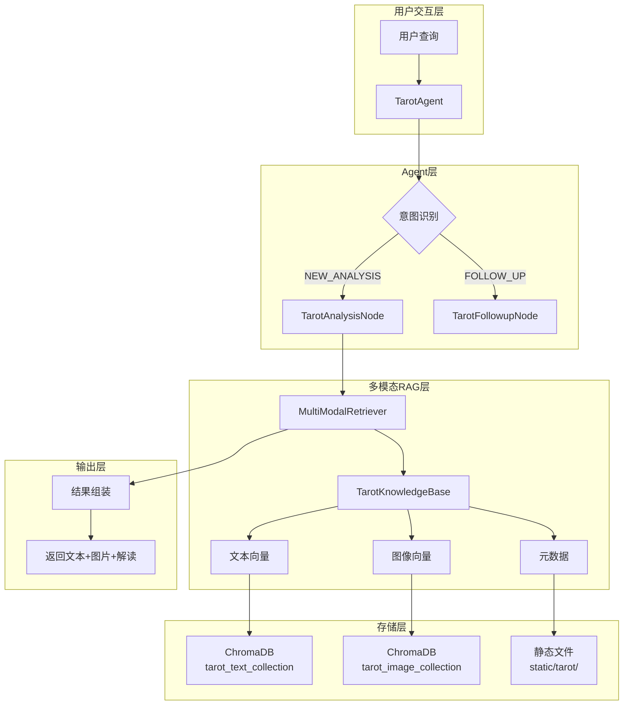

# 塔罗牌多模态RAG架构设计

## 1. 架构概述

基于现有八字Agent系统的模块化设计，塔罗牌系统将采用**独立Agent + 多模态RAG**的架构，既保持领域独立性，又充分利用多模态技术保留塔罗牌画面的核心信息。



## 2. 核心设计原则

### 2.1 领域独立性
- **独立Agent**: [`TarotAgent`](src/agents/tarot_agent.py) 继承 [`BaseAgent`](src/agents/base.py:38)
- **独立知识库**: `tarot_knowledge` collection，与 `bazi_knowledge` 完全隔离
- **独立配置**: 扩展 [`RAG_CONFIG`](src/config/rag_config.py:6) 支持多领域配置

### 2.2 多模态完整性
- **画面优先**: 图像向量作为核心检索维度，文本向量作为辅助
- **信息无损**: 保留原始画面的所有视觉信息，避免文字描述的信息损失
- **版本支持**: 支持多种塔罗牌版本（RWS、Universal Waite等）

### 2.3 工程可扩展性
- **插件化设计**: 多模态组件可独立替换（CLIP/Qwen-VL/BLIP）
- **配置驱动**: 检索策略、融合权重等通过配置文件控制
- **渐进式演进**: 支持从文本RAG平滑升级到多模态RAG

## 3. 详细架构设计

### 3.1 TarotAgent 类结构

```python
# src/agents/tarot_agent.py
class TarotAgent(BaseAgent):
    """塔罗牌占卜 Agent - 多模态RAG支持"""
    
    @property
    def agent_id(self) -> str:
        return "tarot"
    
    @property
    def display_name(self) -> str:
        return "塔罗牌占卜"
    
    @property
    def slot_schema(self) -> SlotSchema:
        return SlotSchema({
            "question_type": {
                "required": True, 
                "keywords": ["爱情", "事业", "财运", "综合", "健康", "学业"]
            },
            "spread_type": {
                "required": False,
                "keywords": ["单张", "三张", "凯尔特十字", "五张", "六张"]
            },
            "deck_version": {
                "required": False,
                "keywords": ["维特", "RWS", "通用", "经典"]
            }
        })
    
    @property
    def intent_keywords(self) -> Dict[str, List[str]]:
        return {
            "NEW_ANALYSIS": [
                "塔罗", "占卜", "牌", "算牌", "抽牌", "塔罗牌", "塔罗占卜",
                "问塔罗", "塔罗预测", "塔罗解读"
            ],
            "FOLLOW_UP": [
                "这张牌", "解释一下", "什么意思", "代表什么", "画面里",
                "为什么", "怎么理解", "详细说说"
            ],
            # ... 其他意图类型
        }
    
    async def handle_analysis(
        self,
        session: UnifiedSession,
        slots: Dict[str, Any],
        mode: str = "full",
    ) -> Dict[str, Any]:
        """执行塔罗牌分析 - 多模态RAG集成"""
        # 1. 验证槽位
        missing = self.slot_schema.get_missing(slots)
        if missing:
            return {"response": f"还需要以下信息：{', '.join(missing)}", "output": None}
        
        # 2. 构建查询
        query = self._build_tarot_query(slots)
        
        # 3. 多模态检索
        retriever = MultiModalRetriever(collection_name="tarot_knowledge")
        results = await retriever.search(query, top_k=5)
        
        # 4. 结果组装（包含图片URL）
        response = self._assemble_response(results, slots)
        return {"response": response, "output": results}
    
    def get_domain_constraints(self) -> str:
        return TAROT_CONSTRAINTS
```

### 3.2 多模态向量存储方案

#### 3.2.1 存储结构设计

```json
// ChromaDB 文档结构
{
  "id": "major_00_fool_rws",
  "document": "愚者牌义文本描述...",
  "metadata": {
    "card_name": "愚者",
    "arcana": "major",
    "number": 0,
    "deck_version": "rider_waite_smith",
    "image_path": "/static/tarot/rider_waite/major/00_fool.jpg",
    "keywords": ["新开始", "冒险", "纯真", "自由"],
    "upright_meaning": ["新机会", "冒险精神", "自发"],
    "reversed_meaning": ["鲁莽", "冒险", "缺乏计划"],
    "symbolism": {
      "figure": "年轻人站在悬崖边",
      "dog": "忠诚的伴侣",
      "white_sun": "纯洁的启示"
    }
  },
  "embeddings": {
    "text_embedding": [0.12, 0.34, ...],    // 文本向量 (768维)
    "image_embedding": [0.45, 0.23, ...],   // 图像向量 (768维)
    "fused_embedding": [0.28, 0.29, ...]    // 融合向量 (768维)
  }
}
```

#### 3.2.2 向量融合策略

```python
# src/rag/multimodal_fusion.py
class MultiModalFusionStrategy:
    """多模态向量融合策略"""
    
    def __init__(self, config: Dict[str, Any]):
        self.text_weight = config.get("text_weight", 0.3)
        self.image_weight = config.get("image_weight", 0.7)
        self.fusion_method = config.get("fusion_method", "weighted_average")
    
    def fuse_embeddings(
        self, 
        text_emb: np.ndarray, 
        image_emb: np.ndarray
    ) -> np.ndarray:
        """融合文本和图像向量"""
        if self.fusion_method == "weighted_average":
            return (
                self.text_weight * text_emb + 
                self.image_weight * image_emb
            )
        elif self.fusion_method == "concatenation":
            return np.concatenate([text_emb, image_emb])
        elif self.fusion_method == "cross_attention":
            # 高级融合策略（可选）
            return self._cross_attention_fusion(text_emb, image_emb)
        else:
            raise ValueError(f"Unknown fusion method: {self.fusion_method}")
```

### 3.3 多模态检索器设计

```python
# src/rag/multimodal_retriever.py
class MultiModalRetriever:
    """多模态检索器 - 支持文本、图像、融合检索"""
    
    def __init__(
        self,
        collection_name: str = "tarot_knowledge",
        fusion_strategy: Optional[MultiModalFusionStrategy] = None,
        retrieval_mode: str = "multimodal_fused"
    ):
        self.collection_name = collection_name
        self.fusion_strategy = fusion_strategy or MultiModalFusionStrategy({})
        self.retrieval_mode = retrieval_mode
        
        # 初始化编码器
        self.text_encoder = TextEncoder()  # DashScope TextEmbedding
        self.image_encoder = ImageEncoder()  # Chinese-CLIP or Qwen-VL
        
        # 初始化向量数据库
        self.vector_store = VectorStore(
            collection_name=collection_name,
            persist_directory="chroma_db"
        )
    
    async def search(
        self, 
        query: str, 
        top_k: int = 5,
        image_query: Optional[str] = None  # 可选：图像路径或URL
    ) -> List[Dict[str, Any]]:
        """多模态检索主入口"""
        
        if self.retrieval_mode == "multimodal_fused":
            return await self._fused_search(query, image_query, top_k)
        elif self.retrieval_mode == "text_only":
            return await self._text_search(query, top_k)
        elif self.retrieval_mode == "image_only":
            if not image_query:
                raise ValueError("Image-only search requires image_query")
            return await self._image_search(image_query, top_k)
        else:
            raise ValueError(f"Unknown retrieval mode: {self.retrieval_mode}")
    
    async def _fused_search(
        self, 
        query: str, 
        image_query: Optional[str], 
        top_k: int
    ) -> List[Dict[str, Any]]:
        """融合检索：文本查询为主，可选图像查询"""
        # 1. 文本编码
        text_emb = self.text_encoder.encode(query)
        
        # 2. 图像编码（如果提供）
        if image_query:
            image_emb = self.image_encoder.encode(image_query)
            query_emb = self.fusion_strategy.fuse_embeddings(text_emb, image_emb)
        else:
            # 纯文本查询，但检索融合向量
            query_emb = text_emb  # 或使用默认融合策略
        
        # 3. 向量检索
        results = self.vector_store.query(
            query_embeddings=[query_emb],
            n_results=top_k,
            include=["documents", "metadatas", "distances"]
        )
        
        return self._format_results(results)
```

### 3.4 知识库构建流程

#### 3.4.1 数据准备目录结构

```
knowledge_base/
├── raw/
│   ├── tarot/
│   │   ├── rider_waite_smith/
│   │   │   ├── major_arcana/
│   │   │   │   ├── 00_fool.json
│   │   │   │   ├── 01_magician.json
│   │   │   │   └── ...
│   │   │   ├── minor_arcana/
│   │   │   │   ├── cups/
│   │   │   │   ├── wands/
│   │   │   │   ├── swords/
│   │   │   │   └── pentacles/
│   │   │   └── images/
│   │   │       ├── major/
│   │   │       └── minor/
│   │   └── universal_waite/
│   │       └── ... (same structure)
│   └── bazi/ (existing)
└── processed/
    └── tarot_chunks.json
```

#### 3.4.2 构建脚本设计

```python
# src/rag/build_tarot_knowledge.py
def build_tarot_knowledge_base():
    """构建塔罗牌多模态知识库"""
    
    # 1. 加载原始数据
    tarot_data = load_tarot_raw_data("knowledge_base/raw/tarot")
    
    # 2. 多模态向量化
    processed_cards = []
    for card_data in tarot_data:
        # 文本向量化
        text_emb = text_encoder.encode(card_data["description"])
        
        # 图像向量化
        image_emb = image_encoder.encode(card_data["image_path"])
        
        # 融合向量化
        fused_emb = fusion_strategy.fuse_embeddings(text_emb, image_emb)
        
        processed_cards.append({
            "id": card_data["id"],
            "document": card_data["description"],
            "metadata": card_data["metadata"],
            "embeddings": {
                "text": text_emb.tolist(),
                "image": image_emb.tolist(),
                "fused": fused_emb.tolist()
            }
        })
    
    # 3. 存储到ChromaDB
    vector_store = VectorStore(collection_name="tarot_knowledge")
    vector_store.add_documents(processed_cards)
    
    # 4. 保存处理记录
    save_processed_md5(tarot_data)
```

### 3.5 图片资源管理策略

#### 3.5.1 静态文件组织

```
static/
├── tarot/
│   ├── rider_waite/
│   │   ├── major/
│   │   │   ├── 00_fool.jpg
│   │   │   ├── 01_magician.jpg
│   │   │   └── ...
│   │   └── minor/
│   │       ├── cups/
│   │       ├── wands/
│   │       ├── swords/
│   │       └── pentacles/
│   └── universal_waite/
│       └── ... (same structure)
└── bazi/ (existing)
```

#### 3.5.2 图片访问策略

- **CDN友好**: 所有图片通过相对路径引用，便于部署到CDN
- **版本控制**: 不同牌组版本独立目录，避免冲突
- **缓存优化**: 图片文件名包含版本信息，支持长期缓存

### 3.6 配置扩展方案

#### 3.6.1 RAG配置扩展

```python
# src/config/rag_config.py
TAROT_RAG_CONFIG: Dict[str, Any] = {
    # 多模态配置
    "multimodal": {
        "enabled": True,
        "text_weight": 0.3,
        "image_weight": 0.7,
        "fusion_method": "weighted_average",
        "image_encoder": "chinese-clip-vit-base-patch16",
        "text_encoder": "text-embedding-v4"
    },
    
    # 塔罗特定配置
    "tarot": {
        "collection_name": "tarot_knowledge",
        "default_deck": "rider_waite_smith",
        "supported_decks": ["rider_waite_smith", "universal_waite"],
        "image_base_path": "/static/tarot/"
    },
    
    # 继承通用配置
    **RAG_CONFIG  # 合并现有配置
}
```

#### 3.6.2 检索模式扩展

```python
# src/config/rag_config.py
RETRIEVAL_MODES.update({
    "multimodal_fused": "多模态融合检索",
    "multimodal_separate": "多模态分离检索",
    "image_only": "纯图像检索",
    "text_only": "纯文本检索"
})
```

## 4. 技术选型建议

### 4.1 多模态模型选择

| 模型 | 推荐度 | 理由 |
|------|--------|------|
| **Chinese-CLIP** | ⭐⭐⭐⭐⭐ | 中文优化，开源免费，与现有架构兼容 |
| **Qwen-VL** | ⭐⭐⭐⭐ | 阿里云生态，中文能力强，API稳定 |
| **OpenAI CLIP** | ⭐⭐⭐ | 国际标准，但中文支持一般 |

### 4.2 向量数据库

- **继续使用ChromaDB**: 已有基础设施，支持多collection
- **扩展字段**: 在metadata中存储多模态相关信息

### 4.3 图像处理

- **PIL/Pillow**: 基础图像处理
- **OpenCV**: 高级图像处理（可选）
- **预处理**: 统一图像尺寸（224x224），格式标准化

## 5. 实施路线图

### Phase 1: 基础架构搭建 (1-2周)
- [ ] 创建 `TarotAgent` 类
- [ ] 实现基础槽位和意图识别
- [ ] 准备塔罗牌数据结构

### Phase 2: 多模态RAG实现 (2-3周)
- [ ] 集成多模态编码器
- [ ] 实现多模态向量存储
- [ ] 开发多模态检索器

### Phase 3: 知识库构建 (1周)
- [ ] 准备78张塔罗牌数据
- [ ] 构建多模态向量库
- [ ] 部署图片资源

### Phase 4: 测试优化 (1周)
- [ ] 功能测试
- [ ] 性能优化
- [ ] 用户体验调优

## 6. 风险评估与应对

### 6.1 技术风险
- **风险**: 多模态模型效果不如预期
- **应对**: 保留纯文本RAG作为降级方案

### 6.2 性能风险
- **风险**: 图像处理增加响应时间
- **应对**: 异步处理、缓存优化、批量处理

### 6.3 数据风险
- **风险**: 塔罗牌版权问题
- **应对**: 使用开源/公共领域牌面，或自行绘制简化版

## 7. 面试价值亮点

1. **技术深度**: 多模态RAG在实际项目中的应用
2. **架构能力**: 模块化设计，可扩展性强
3. **领域理解**: 认识到塔罗牌画面的核心价值
4. **工程实践**: 完整的MLOps流程（数据→训练→部署→监控）
5. **创新思维**: 将传统占卜与现代AI技术结合