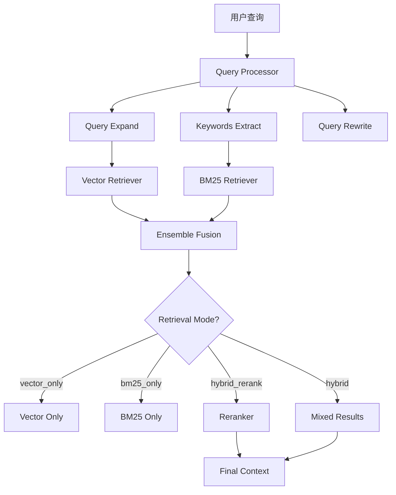

# Bazi-Agent 技术升级方案

## 一、项目现状分析

### 1.1 现有架构
```
src/
├── config/              # 配置模块（缺失）
├── skills/              # 技能模块（基础实现）
│   ├── memory_skill.py
│   └── conversation_skill.py
├── rag/                 # 检索模块（基础实现）
│   └── retriever.py
├── prompts/             # 提示词模块
│   ├── safety_prompt.py
│   └── chat_prompt.py
├── graph/               # LangGraph 工作流
│   ├── state.py
│   ├── nodes.py
│   └── bazi_graph.py
├── memory/              # 记忆管理
│   └── memory_manager.py
└── api/                 # API 接口
    └── bazi_api.py
```

### 1.2 现有功能
- ✅ 八字排盘计算
- ✅ 五行分析
- ✅ 格局判断
- ✅ 喜用神分析
- ✅ 流年分析
- ✅ RAG 知识检索（向量检索）
- ✅ 安全合规检查
- ✅ 报告生成

### 1.3 待完善功能
- ❌ 模型配置化管理
- ❌ 混合检索（Vector + BM25）
- ❌ 重排序模块
- ❌ 上下文策略管理
- ❌ OpenAI 标准消息格式
- ❌ 微调数据导出
- ❌ 多轮对话完整实现

---

## 二、技术方案详情

### 2.1 模型配置化设计

#### 2.1.1 配置文件：`src/config/model_config.py`

```python
MODEL_CONFIGS = {
    "qwen-plus": {
        "context_window": 128000,
        "max_output": 6000,
        "supports_streaming": True,
    },
    "qwen-turbo": {
        "context_window": 128000,
        "max_output": 6000,
        "supports_streaming": True,
    },
    "qwen-long": {
        "context_window": 1000000,
        "max_output": 10000,
        "supports_streaming": True,
    },
    "deepseek-v3": {
        "context_window": 64000,
        "max_output": 8000,
        "supports_streaming": True,
    },
}

class ModelConfig:
    """动态模型配置管理"""
    
    def __init__(self, model_name: str = "qwen-plus"):
        self.config = MODEL_CONFIGS.get(model_name, MODEL_CONFIGS["qwen-plus"])
        
    @property
    def context_window(self) -> int:
        return self.config["context_window"]
    
    def get_max_history_tokens(self, reserve_ratio: float = 0.3) -> int:
        """获取最大历史 token 数（预留输出空间）"""
        return int(self.context_window * (1 - reserve_ratio))
```

#### 2.1.2 集成方式
- [`DashScopeLLM`](src/llm/dashscope_llm.py:16) 类中添加 `model_config` 参数
- 支持动态切换模型，自动调整上下文窗口

---

### 2.2 上下文管理策略

#### 2.2.1 策略枚举：`src/skills/context_skill.py`

```python
from enum import Enum
from typing import List, Dict

class ContextStrategy(Enum):
    """上下文管理策略"""
    FULL_CONTEXT = "full"           # 全量上下文（大窗口模型）
    SLIDING_WINDOW = "sliding"      # 滑动窗口（小窗口模型）
    HYBRID = "hybrid"               # 混合策略（摘要+窗口）

class ContextSkill:
    """
    上下文构建技能
    
    支持多种策略，根据模型动态选择
    """
    
    def __init__(
        self, 
        strategy: ContextStrategy = ContextStrategy.FULL_CONTEXT,
        model_config: ModelConfig = None
    ):
        self.strategy = strategy
        self.model_config = model_config or ModelConfig()
        
    def build_context(
        self, 
        session_id: str,
        memory: "MemorySkill"
    ) -> List[Dict]:
        """构建上下文，根据策略返回不同格式"""
        if self.strategy == ContextStrategy.FULL_CONTEXT:
            return self._build_full_context(session_id, memory)
        elif self.strategy == ContextStrategy.SLIDING_WINDOW:
            return self._build_sliding_context(session_id, memory)
        else:
            return self._build_hybrid_context(session_id, memory)
```

#### 2.2.2 策略选择逻辑
| 模型 | 推荐策略 | 窗口大小 |
|------|---------|---------|
| qwen-plus | hybrid | 20 轮 |
| qwen-turbo | sliding | 10 轮 |
| qwen-long | full | 全量 |
| deepseek-v3 | hybrid | 15 轮 |

---

### 2.3 会话数据格式（OpenAI 标准）

#### 2.3.1 数据结构

```python
{
  "session_id": "user_20240315_abc123",
  "user_id": "user_001",
  "created_at": "2024-03-15T10:30:00",
  "updated_at": "2024-03-15T11:45:00",
  
  "bazi_cache": {
    "birth_info": {"year": 1990, "month": 5, "day": 15, "hour": 8, "gender": "男"},
    "four_pillars": {...},
    "geju": "正官格",
    "yongshen": ["木", "火"],
    "jishen": ["金", "水"],
    "calculated_at": "2024-03-15T10:31:00"
  },
  
  "messages": [
    {
      "role": "system",
      "content": "你是赛博司命...",
      "timestamp": "2024-03-15T10:30:00"
    },
    {
      "role": "user",
      "content": "我是1990年5月15日早上8点出生的男命...",
      "timestamp": "2024-03-15T10:30:05"
    },
    {
      "role": "assistant",
      "content": "根据您的出生信息...",
      "timestamp": "2024-03-15T10:31:00"
    }
  ],
  
  "metadata": {
    "model": "qwen-plus",
    "total_tokens": 3500,
    "message_count": 5,
    "topics": ["事业", "财运"],
    "intents": ["NEW_ANALYSIS", "FOLLOW_UP"]
  }
}
```

#### 2.3.2 更新 [`MemoryManager`](src/memory/memory_manager.py:14)
- 支持 OpenAI 标准消息格式
- 添加 `bazi_cache` 字段存储八字数据
- 添加 `metadata` 字段存储元数据

---

### 2.4 微调数据集导出

#### 2.4.1 导出工具：`src/skills/export_skill.py`

```python
class FineTuningExporter:
    """
    微调数据集导出工具
    
    支持导出为 OpenAI 微调格式
    """
    
    @staticmethod
    def to_openai_format(session_data: Dict) -> Dict:
        """
        转换为 OpenAI 微调格式
        
        输出格式：
        {
            "messages": [
                {"role": "system", "content": "..."},
                {"role": "user", "content": "..."},
                {"role": "assistant", "content": "..."}
            ]
        }
        """
        messages = []
        
        # 添加系统提示词
        system_prompt = SafetyPromptBuilder.build_system_prompt()
        messages.append({"role": "system", "content": system_prompt})
        
        # 添加对话历史
        for msg in session_data.get("messages", []):
            if msg["role"] in ["user", "assistant"]:
                messages.append({
                    "role": msg["role"],
                    "content": msg["content"]
                })
        
        return {"messages": messages}
    
    @staticmethod
    def export_dataset(
        sessions: List[Dict], 
        output_path: str,
        format: str = "openai"
    ) -> None:
        """批量导出为微调数据集（JSONL 格式）"""
        import json
        
        with open(output_path, 'w', encoding='utf-8') as f:
            for session in sessions:
                if format == "openai":
                    data = FineTuningExporter.to_openai_format(session)
                f.write(json.dumps(data, ensure_ascii=False) + '\n')
```

---

### 2.5 RAG 混合检索架构

#### 2.5.1 架构图



#### 2.5.2 检索器实现

**1. 向量检索器（已有）**
- [`src/rag/retriever.py`](src/rag/retriever.py:10) - `KnowledgeRetriever`

**2. BM25 检索器（新增）**
```python
# src/rag/bm25_retriever.py

import jieba
from typing import List, Dict

class BM25Retriever:
    """BM25 关键词检索器"""
    
    def __init__(self, index_path: str = "data/bm25_index"):
        self.index_path = index_path
        self.documents = []
        self.doc_freqs = {}
        self.avgdl = 0
        self.k1 = 1.5
        self.b = 0.75
        
    def search(self, query: str, top_k: int = 10) -> List[Dict]:
        """执行 BM25 检索"""
        query_tokens = list(jieba.cut(query))
        scores = self._calculate_scores(query_tokens)
        
        sorted_docs = sorted(scores.items(), key=lambda x: x[1], reverse=True)
        
        return [
            {
                'id': doc_id,
                'content': self.documents[doc_id]['content'],
                'metadata': self.documents[doc_id].get('metadata', {}),
                'score': score
            }
            for doc_id, score in sorted_docs[:top_k]
        ]
```

**3. 混合检索器（新增）**
```python
# src/rag/hybrid_retriever.py

from enum import Enum
from typing import List, Dict

class RetrievalMode(Enum):
    """检索模式"""
    VECTOR_ONLY = "vector"
    BM25_ONLY = "bm25"
    HYBRID = "hybrid"
    HYBRID_RERANK = "hybrid_rerank"

class HybridRetriever:
    """混合检索器"""
    
    def __init__(
        self,
        chroma_path: str = "data/chroma_db",
        mode: RetrievalMode = RetrievalMode.HYBRID_RERANK,
        vector_weight: float = 0.6,
        top_k: int = 5
    ):
        self.mode = mode
        self.vector_weight = vector_weight
        self.bm25_weight = 1 - vector_weight
        self.top_k = top_k
        
        self.vector_retriever = VectorRetriever(chroma_path)
        self.bm25_retriever = BM25Retriever()
        self.reranker = Reranker() if mode == RetrievalMode.HYBRID_RERANK else None
        
    def retrieve(self, query: str, top_k: int = None) -> List[Dict]:
        """执行检索"""
        top_k = top_k or self.top_k
        
        if self.mode == RetrievalMode.VECTOR_ONLY:
            return self._vector_search(query, top_k)
        elif self.mode == RetrievalMode.BM25_ONLY:
            return self._bm25_search(query, top_k)
        elif self.mode == RetrievalMode.HYBRID:
            return self._hybrid_search(query, top_k)
        else:
            return self._hybrid_rerank_search(query, top_k)
```

**4. 重排序器（新增）**
```python
# src/rag/reranker.py

from typing import List, Dict

class Reranker:
    """重排序器"""
    
    def __init__(self, model: str = "bge-reranker-v2-m3"):
        self.model = model
        
    def rerank(
        self, 
        query: str, 
        candidates: List[Dict], 
        top_k: int
    ) -> List[Dict]:
        """对候选文档进行重排序"""
        rerank_scores = self._compute_rerank_scores(query, candidates)
        
        for i, score in enumerate(rerank_scores):
            candidates[i]['rerank_score'] = score
            
        sorted_candidates = sorted(
            candidates, 
            key=lambda x: x['rerank_score'], 
            reverse=True
        )
        
        return sorted_candidates[:top_k]
```

#### 2.5.3 配置文件：`src/config/rag_config.py`

```python
RAG_CONFIG = {
    # 检索模式
    "retrieval_mode": "hybrid_rerank",  # vector / bm25 / hybrid / hybrid_rerank
    
    # 向量检索配置
    "vector": {
        "embedding_model": "text-embedding-v4",
        "top_k": 10,
        "distance_metric": "cosine"
    },
    
    # BM25 配置
    "bm25": {
        "k1": 1.5,
        "b": 0.75,
        "top_k": 10
    },
    
    # 混合检索配置
    "hybrid": {
        "vector_weight": 0.6,
        "bm25_weight": 0.4,
        "candidate_multiplier": 4
    },
    
    # 重排序配置
    "rerank": {
        "model": "bge-reranker-v2-m3",
        "top_k": 5
    }
}
```

---

### 2.6 提示词模块更新

#### 2.6.1 安全合规提示词（已存在，需完善）
- [`src/prompts/safety_prompt.py`](src/prompts/safety_prompt.py:1)

#### 2.6.2 多轮对话提示词（已存在，需完善）
- [`src/prompts/chat_prompt.py`](src/prompts/chat_prompt.py:1)

#### 2.6.3 新增提示词
```python
# src/prompts/context_prompt.py

FULL_CONTEXT_PROMPT = """
# 完整上下文模式
使用所有历史对话作为上下文。
"""

SLIDING_WINDOW_PROMPT = """
# 滑动窗口模式
仅使用最近 {window_size} 轮对话作为上下文。
"""

HYBRID_PROMPT = """
# 混合模式
使用最近 {window_size} 轮对话 + 关键信息摘要作为上下文。
"""
```

---

### 2.7 LangGraph State 更新

#### 2.7.1 更新 [`BaziAgentState`](src/graph/state.py:9)

```python
class BaziAgentState(TypedDict, total=False):
    """LangGraph 状态定义"""
    
    # ... 现有字段 ...
    
    # ✨ 新增：多轮对话支持
    session_id: Optional[str]  # 会话ID
    messages: List[Dict]  # OpenAI 标准消息格式
    context_strategy: Optional[str]  # 上下文策略
    model_name: Optional[str]  # 当前使用的模型
    
    # ✨ 新增：RAG 混合检索
    retrieval_mode: Optional[str]  # 检索模式
    hybrid_scores: Optional[Dict]  # 混合检索分数
    reranked_docs: Optional[List[Dict]]  # 重排序后的文档
    
    # ✨ 新增：元数据
    metadata: Optional[Dict]  # 会话元数据
    total_tokens: Optional[int]  # 总 token 消耗
```

---

### 2.8 新增节点

#### 2.8.1 对话节点
```python
# src/graph/nodes.py

def chat_node(state: BaziAgentState) -> Dict[str, Any]:
    """多轮对话节点"""
    logger.info("【对话节点】执行多轮对话...")
    
    session_id = state.get("session_id")
    messages = state.get("messages", [])
    
    # 构建上下文
    context_skill = ContextSkill(
        strategy=state.get("context_strategy", "hybrid")
    )
    context = context_skill.build_context(session_id, memory_skill)
    
    # 调用 LLM
    response = llm.call(
        prompt=user_message,
        system_prompt=build_system_prompt(context),
        history=messages
    )
    
    return {
        "llm_response": response,
        "messages": messages + [
            {"role": "user", "content": user_message},
            {"role": "assistant", "content": response}
        ]
    }


def intent_router_node(state: BaziAgentState) -> Literal["chat", "analysis", "followup"]:
    """意图路由节点"""
    intent = detect_intent(state.get("user_input", ""))
    
    if intent == "NEW_ANALYSIS":
        return "analysis"
    elif intent == "FOLLOW_UP":
        return "followup"
    else:
        return "chat"
```

---

### 2.9 存储层设计

#### 2.9.1 新建存储模块：`src/storage/`

```
src/storage/
├── __init__.py
├── file_storage.py      # 文件存储（JSON）
├── memory_storage.py    # 内存缓存
└── models.py            # 数据模型
```

#### 2.9.2 数据模型
```python
# src/storage/models.py

from pydantic import BaseModel
from typing import Dict, List, Optional
from datetime import datetime

class SessionData(BaseModel):
    """会话数据模型"""
    session_id: str
    user_id: str
    created_at: datetime
    updated_at: datetime
    
    bazi_cache: Optional[Dict] = None
    messages: List[Dict] = []
    metadata: Optional[Dict] = None

class StorageConfig(BaseModel):
    """存储配置"""
    storage_path: str = "data/memory"
    cache_size: int = 100
    persistence: bool = True
```

---

### 2.10 API 接口更新

#### 2.10.1 新增多轮对话 API
```python
# src/api/chat_api.py

from fastapi import APIRouter, HTTPException
from pydantic import BaseModel
from typing import Dict, List, Optional

router = APIRouter(prefix="/api/v1/chat", tags=["多轮对话"])

class ChatInput(BaseModel):
    """聊天输入模型"""
    session_id: Optional[str] = None  # 新对话可不传
    user_id: str = "default"
    message: str
    model: str = "qwen-plus"
    context_strategy: str = "hybrid"

class ChatResponse(BaseModel):
    """聊天响应模型"""
    success: bool
    message: str
    session_id: str
    response: str
    metadata: Optional[Dict] = None

@router.post("/chat", response_model=ChatResponse)
async def chat(input_data: ChatInput):
    """多轮对话接口"""
    # 创建或获取会话
    session_id = input_data.session_id or memory_manager.create_conversation(
        user_id=input_data.user_id
    )
    
    # 执行对话
    result = chat_agent.invoke({
        "user_input": input_data.message,
        "session_id": session_id,
        "model_name": input_data.model,
        "context_strategy": input_data.context_strategy
    })
    
    return ChatResponse(
        success=True,
        message="对话成功",
        session_id=session_id,
        response=result.get("llm_response", ""),
        metadata={
            "total_tokens": result.get("total_tokens", 0),
            "intent": result.get("intent", "")
        }
    )
```

---

## 三、实施计划

### 3.1 阶段一：基础模块（1-2天）
- [ ] 创建配置模块 (`src/config/`)
- [ ] 创建存储层 (`src/storage/`)
- [ ] 更新数据模型

### 3.2 阶段二：核心技能（2-3天）
- [ ] 实现 `MemorySkill`（OpenAI 格式）
- [ ] 实现 `ContextSkill`（多策略）
- [ ] 实现 `ConversationSkill`（意图识别）

### 3.3 阶段三：RAG 扩展（3-4天）
- [ ] 实现 `BM25Retriever`
- [ ] 实现 `HybridRetriever`
- [ ] 实现 `Reranker`
- [ ] 配置 RAG 检索模式

### 3.4 阶段四：LangGraph 更新（2-3天）
- [ ] 更新 State 定义
- [ ] 新增对话节点
- [ ] 更新工作流

### 3.5 阶段五：API 与导出（1-2天）
- [ ] 创建多轮对话 API
- [ ] 创建微调数据导出工具
- [ ] 更新文档

### 3.6 阶段六：测试与优化（2-3天）
- [ ] 单元测试
- [ ] 集成测试
- [ ] 性能优化
- [ ] 文档更新

---

## 四、技术亮点

| 技术点 | 描述 | 体现能力 |
|--------|------|----------|
| 模型配置化 | 支持多模型切换，动态上下文窗口 | 系统扩展性设计 |
| 混合检索 | Vector + BM25 + Rerank 三阶段召回 | RAG 高级应用 |
| OpenAI 格式 | 标准消息格式，支持微调数据导出 | 数据工程能力 |
| 上下文工程 | 多策略支持，适配不同模型 | LLM 应用深度 |
| Skill 架构 | 模块化封装，高内聚低耦合 | 架构设计能力 |

---

## 五、风险与挑战

### 5.1 技术风险
- **BM25 实现**：需要处理中文分词和索引构建
- **重排序性能**：BGE-Reranker 本地模型可能较慢
- **混合检索融合**：需要调优向量和关键词的权重

### 5.2 解决方案
- 使用 `jieba` 分词 + `rank-bm25` 库
- 重排序使用 API（DashScope）或异步处理
- 通过实验调优权重参数

---

## 六、后续优化方向

1. **缓存优化**：添加 Redis 缓存层
2. **检索加速**：使用 HNSW 索引加速向量检索
3. **自动策略选择**：根据查询类型自动选择上下文策略
4. **会话摘要**：长对话自动摘要，减少 token 消耗